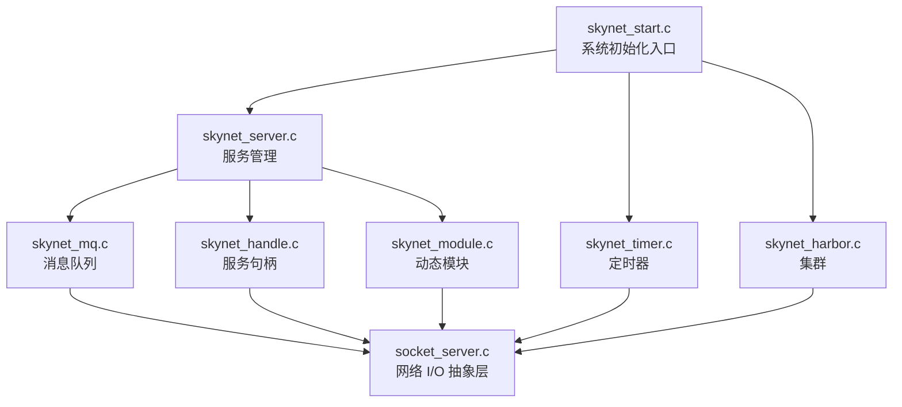

# 核心模块概览

Skynet 的核心由 C 语言实现。在阅读源码的过程中，我们整理了各个模块的职责和依赖关系，方便理解整体架构。

## 模块依赖关系



## 核心模块列表

### 1. skynet_start.c - 系统启动

**职责**：初始化整个 Skynet 系统

**核心函数**：
- `skynet_start()`：系统入口点
- `start_thread()`：创建工作线程
- `thread_worker()`：工作线程主循环

**启动流程**：
1. 解析配置
2. 初始化各子系统
3. 创建工作线程
4. 加载启动服务
5. 进入主循环

### 2. skynet_server.c - 服务管理

**职责**：服务的创建、销毁、消息处理

**核心数据结构**：
```c
struct skynet_context {
    void *instance;           // 服务实例
    struct skynet_module *mod; // 模块指针
    void *cb_ud;              // 回调用户数据
    skynet_cb cb;             // 消息回调函数
    struct message_queue *queue; // 消息队列
    char result[32];          // 结果缓冲区
    uint32_t handle;          // 服务句柄
    int session_id;           // 会话 ID
    int ref;                  // 引用计数
    char *name;               // 服务名称
};
```

**核心函数**：
- `skynet_context_new()`：创建新服务
- `skynet_context_grab()`：增加引用
- `skynet_context_release()`：减少引用
- `skynet_send()`：发送消息
- `skynet_callback()`：设置回调函数

### 3. skynet_mq.c - 消息队列

**职责**：管理服务的消息队列

**核心数据结构**：
```c
struct message_queue {
    struct spinlock lock;     // 自旋锁
    uint32_t handle;          // 所属服务句柄
    int cap;                  // 队列容量
    int head;                 // 队列头
    int tail;                 // 队列尾
    int in_global;           // 是否在全局队列中
    struct skynet_message *queue; // 消息数组
};
```

**核心函数**：
- `skynet_mq_create()`：创建消息队列
- `skynet_mq_push()`：消息入队
- `skynet_mq_pop()`：消息出队
- `skynet_mq_mark_release()`：标记队列为释放状态

**全局队列**：
```c
struct global_queue {
    struct message_queue *head; // 队列链表头
    struct message_queue *tail; // 队列链表尾
    struct spinlock lock;       // 自旋锁
};
```

### 4. skynet_handle.c - 服务句柄

**职责**：管理服务的句柄映射

**核心数据结构**：
```c
struct handle_storage {
    struct rwlock lock;        // 读写锁
    uint32_t harbor;          // Harbor ID
    int slot_size;            // 槽位大小
    struct skynet_context **slot; // 服务数组
};
```

**核心函数**：
- `skynet_handle_register()`：注册服务
- `skynet_handle_retire()`：注销服务
- `skynet_handle_grab()`：获取服务
- `skynet_handle_findname()`：按名称查找

### 5. skynet_module.c - 动态模块

**职责**：加载和管理 C 服务模块

**模块接口**：
```c
struct skynet_module {
    const char *name;         // 模块名称
    void *module;             // 动态库句柄
    void *(*init)(const char *args); // 初始化函数
    void (*release)(void *inst);     // 释放函数
    void (*signal)(void *inst, int signal); // 信号处理
};
```

**核心函数**：
- `skynet_module_create()`：创建模块实例
- `skynet_module_instance_release()`：释放模块实例
- `skynet_module_query()`：查询模块

### 6. skynet_timer.c - 定时器

**职责**：提供定时器功能

**核心数据结构**：
```c
struct timer {
    struct link_list near[4][64]; // 近期定时器（时间轮）
    struct link_list far[4][64];  // 远期定时器
    struct spinlock lock;         // 自旋锁
    uint32_t time;               // 当前时间
    uint32_t starttime;          // 启动时间
    uint64_t current;            // 当前时间戳
    uint64_t current_point;      // 当前时间点
};
```

**核心函数**：
- `skynet_timer_init()`：初始化定时器
- `skynet_timer_timeout()`：设置超时
- `skynet_timer_update()`：更新定时器

### 7. socket_server.c - 网络 I/O

**职责**：提供统一的网络 I/O 抽象

**核心数据结构**：
```c
struct socket {
    int fd;                    // 文件描述符
    int id;                    // socket ID
    int type;                  // socket 类型
    int size;                  // 缓冲区大小
    struct wb_list high;       // 高优先级写缓冲
    struct wb_list low;        // 低优先级写缓冲
    int stat;                  // 状态
    int64_t wb_size;           // 写缓冲大小
    uint32_t watching;         // 监控标志
    void *p;                   // 用户数据
};
```

**核心函数**：
- `socket_server_create()`：创建 socket 服务器
- `socket_server_listen()`：监听连接
- `socket_server_send()`：发送数据
- `socket_server_poll()`：轮询事件

### 8. skynet_harbor.c - 集群

**职责**：支持跨节点服务调用

**核心函数**：
- `skynet_harbor_start()`：启动 Harbor
- `skynet_harbor_send()`：发送跨节点消息
- `skynet_harbor_register()`：注册全局服务

### 9. skynet_daemon.c - 守护进程

**职责**：将 Skynet 作为守护进程运行

**核心函数**：
- `daemon_init()`：初始化守护进程
- `daemon_exit()`：退出守护进程

### 10. skynet_log.c - 日志

**职责**：日志记录

**核心函数**：
- `skynet_error()`：记录错误日志
- `skynet_log_init()`：初始化日志系统

## 模块间通信

### 消息传递流程

```
┌─────────────┐    skynet_send()    ┌─────────────┐
│  服务 A     │ ──────────────────→ │  服务 B     │
└─────────────┘                    └─────────────┘
       │                                  │
       │                                  │
       ▼                                  ▼
┌─────────────┐                    ┌─────────────┐
│ 消息队列 A  │                    │ 消息队列 B  │
└─────────────┘                    └─────────────┘
       │                                  │
       │ skynet_mq_push()                │ skynet_mq_pop()
       ▼                                  ▼
┌─────────────────────────────────────────────┐
│              全局消息队列                    │
└─────────────────────────────────────────────┘
```

### 跨节点通信

```
┌─────────────┐                  ┌─────────────┐
│  节点 A     │                  │  节点 B     │
│  ┌─────────┐│    Harbor       │┌─────────┐  │
│  │ Harbor  ││ ←──────────────→ ││ Harbor  │  │
│  └─────────┘│    TCP 连接     │└─────────┘  │
│  ┌─────────┐│                  │┌─────────┐  │
│  │ 服务    ││                  ││ 服务    │  │
│  └─────────┘│                  │└─────────┘  │
└─────────────┘                  └─────────────┘
```

## 关键设计模式

### 1. 引用计数
服务使用引用计数管理生命周期：
```c
// 增加引用
skynet_context_grab(ctx);

// 减少引用
skynet_context_release(ctx);
```

### 2. 自旋锁
消息队列使用自旋锁保护：
```c
spinlock_lock(&q->lock);
// 临界区操作
spinlock_unlock(&q->lock);
```

### 3. 读写锁
服务句柄表使用读写锁：
```c
// 读操作
rwlock_rlock(&s->lock);
// 读取操作
rwlock_runlock(&s->lock);

// 写操作
rwlock_wlock(&s->lock);
// 写入操作
rwlock_wunlock(&s->lock);
```

### 4. 回调函数
服务通过回调函数处理消息：
```c
typedef int (*skynet_cb)(struct skynet_context *ctx, 
    void *ud, 
    int type, 
    int session, 
    uint32_t source, 
    const void *msg, 
    size_t sz);
```

## 下一步

- [skynet_server.c 详解](/analysis/skynet-server) - 深入理解服务管理
- [skynet_mq.c 详解](/analysis/skynet-mq) - 消息队列的实现细节
- [skynet_timer.c 详解](/analysis/skynet-timer) - 定时器的实现原理
- [socket_server.c 详解](/analysis/socket-server) - 网络 I/O 的实现
