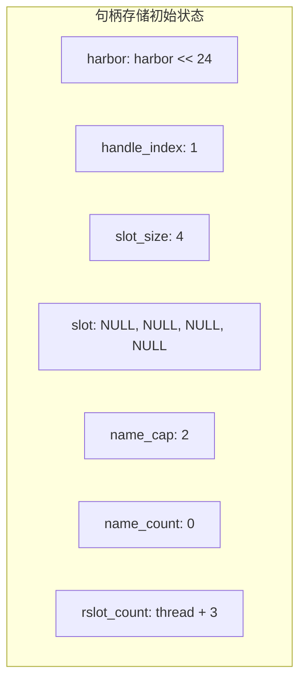
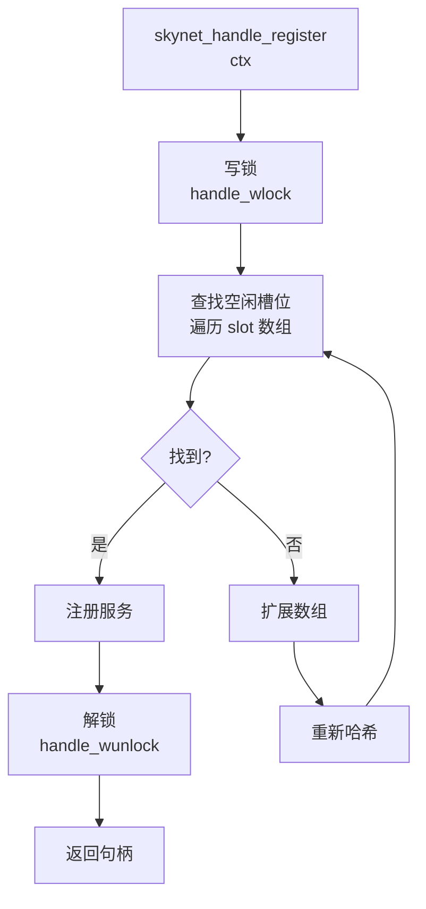
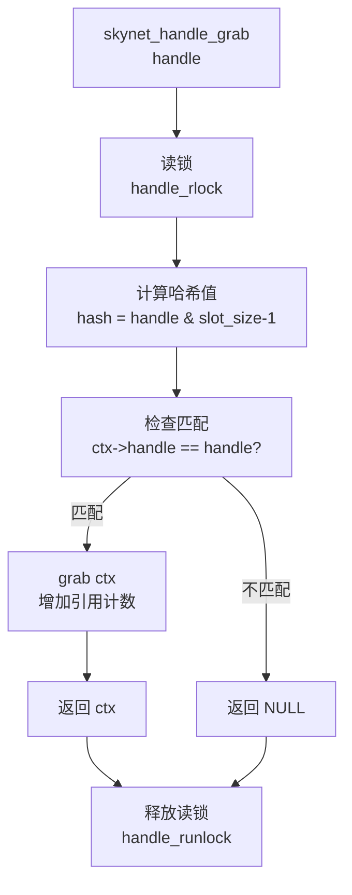
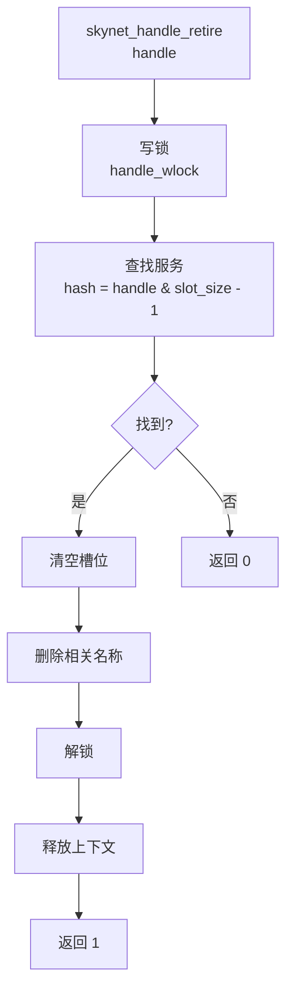
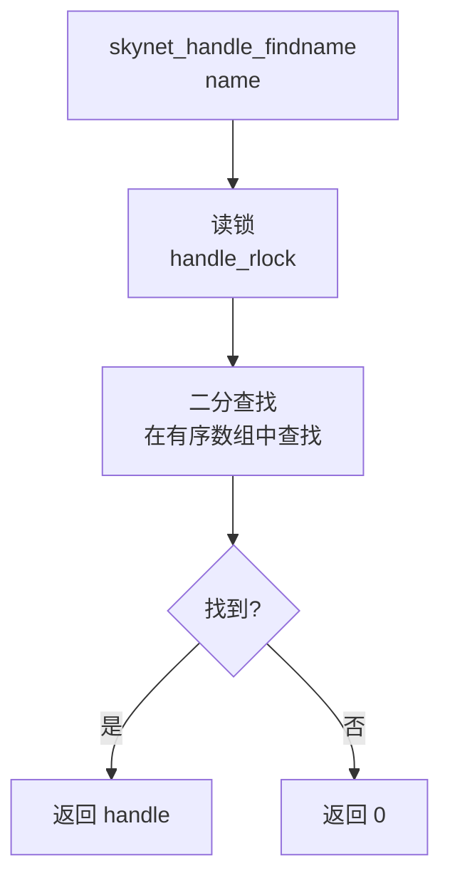
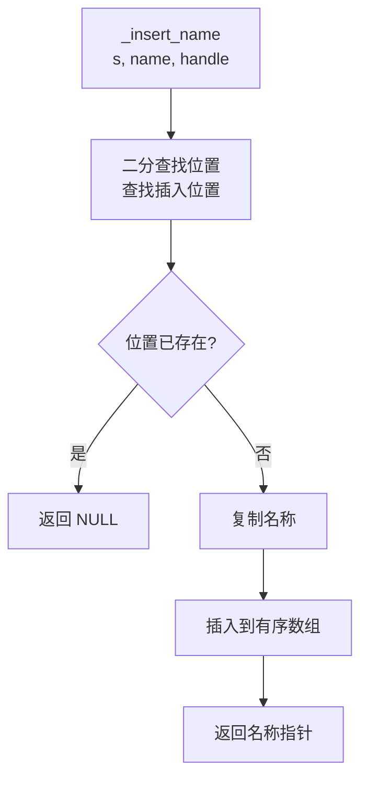

# skynet_handle.c 源码分析

`skynet_handle.c` 负责管理服务的句柄映射，是 Skynet 框架的核心组件。在实际项目中，我们发现这个模块的设计对服务查找和管理的效率有直接影响。

## 文件概览

**职责**：服务句柄管理、名称服务

**核心数据结构**：
- `handle_storage` - 句柄存储
- `handle_name` - 名称映射
- `handle_reader_slot` - 读锁优化

**关键函数**：
- `skynet_handle_register()` - 注册服务
- `skynet_handle_grab()` - 获取服务
- `skynet_handle_retire()` - 注销服务
- `skynet_handle_findname()` - 按名称查找

## 核心数据结构

### handle_storage - 句柄存储

```c
struct handle_storage {
    struct rwlock lock;           // 读写锁
    uint32_t harbor;             // Harbor ID
    uint32_t handle_index;       // 句柄索引
    int slot_size;               // 槽位大小
    struct skynet_context ** slot; // 服务数组
    
    int name_cap;                // 名称容量
    int name_count;              // 名称数量
    struct handle_name *name;    // 名称数组
    
    // 分布式读锁优化
    ATOM_INT thread_idx;         // 线程索引
    int rslot_count;             // 读槽位数量
    struct handle_reader_slot *rslots; // 读槽位数组
};
```

**设计要点**：

1. **哈希表**：使用哈希表存储服务句柄映射
2. **读写锁**：使用读写锁保证线程安全
3. **名称服务**：支持按名称查找服务
4. **分布式读锁**：优化读操作性能

### handle_name - 名称映射

```c
struct handle_name {
    char * name;      // 服务名称
    uint32_t handle;  // 服务句柄
};
```

### handle_reader_slot - 读锁优化

```c
struct handle_reader_slot {
    ATOM_INT active;  // 是否活跃
    char _pad[HANDLE_CACHE_LINE - sizeof(ATOM_INT)]; // 缓存行填充
};
```

## 初始化

### skynet_handle_init()

```c
void
skynet_handle_init(int harbor, int thread) {
    assert(H == NULL);
    
    // 分配存储结构
    struct handle_storage * s = skynet_malloc(sizeof(*H));
    
    // 初始化槽位
    s->slot_size = DEFAULT_SLOT_SIZE;  // 默认 4
    s->slot = skynet_malloc(s->slot_size * sizeof(struct skynet_context *));
    memset(s->slot, 0, s->slot_size * sizeof(struct skynet_context *));
    
    // 初始化读写锁
    rwlock_init(&s->lock);
    
    // 初始化分布式读槽位
    // workers + monitor + timer + socket
    s->rslot_count = thread + 3;
    size_t rslot_sz = (size_t)s->rslot_count * sizeof(struct handle_reader_slot);
    s->rslots = (struct handle_reader_slot *)skynet_malloc(rslot_sz);
    memset(s->rslots, 0, rslot_sz);
    ATOM_INIT(&s->thread_idx, 0);
    
    // 设置 Harbor ID
    s->harbor = (uint32_t)(harbor & 0xff) << HANDLE_REMOTE_SHIFT;
    
    // 初始化句柄索引（0 保留给系统）
    s->handle_index = 1;
    
    // 初始化名称数组
    s->name_cap = 2;
    s->name_count = 0;
    s->name = skynet_malloc(s->name_cap * sizeof(struct handle_name));
    
    H = s;
}
```

**初始化状态**：



## 句柄管理

### 1. 注册句柄 - skynet_handle_register()

```c
uint32_t
skynet_handle_register(struct skynet_context *ctx) {
    struct handle_storage *s = H;
    
    handle_wlock(s);  // 写锁
    
    for (;;) {
        int i;
        uint32_t handle = s->handle_index;
        
        // 1. 查找空闲槽位
        for (i = 0; i < s->slot_size; i++, handle++) {
            if (handle > HANDLE_MASK) {
                // 句柄溢出，从 1 开始
                handle = 1;
            }
            
            int hash = handle & (s->slot_size - 1);
            if (s->slot[hash] == NULL) {
                // 2. 找到空闲槽位，注册服务
                s->slot[hash] = ctx;
                s->handle_index = handle + 1;
                
                handle_wunlock(s);
                
                // 3. 添加 Harbor ID
                handle |= s->harbor;
                return handle;
            }
        }
        
        // 4. 没有空闲槽位，扩展数组
        assert((s->slot_size * 2 - 1) <= HANDLE_MASK);
        struct skynet_context ** new_slot = skynet_malloc(s->slot_size * 2 * sizeof(struct skynet_context *));
        memset(new_slot, 0, s->slot_size * 2 * sizeof(struct skynet_context *));
        
        // 5. 重新哈希
        for (i = 0; i < s->slot_size; i++) {
            if (s->slot[i]) {
                int hash = skynet_context_handle(s->slot[i]) & (s->slot_size * 2 - 1);
                assert(new_slot[hash] == NULL);
                new_slot[hash] = s->slot[i];
            }
        }
        
        // 6. 替换旧数组
        skynet_free(s->slot);
        s->slot = new_slot;
        s->slot_size *= 2;
    }
}
```

**注册流程**：



### 2. 获取服务 - skynet_handle_grab()

```c
struct skynet_context *
skynet_handle_grab(uint32_t handle) {
    struct handle_storage *s = H;
    struct skynet_context * result = NULL;
    
    handle_rlock(s);  // 读锁
    
    // 1. 计算哈希值
    uint32_t hash = handle & (s->slot_size - 1);
    struct skynet_context * ctx = s->slot[hash];
    
    // 2. 检查句柄是否匹配
    if (ctx && skynet_context_handle(ctx) == handle) {
        result = ctx;
        skynet_context_grab(result);  // 增加引用计数
    }
    
    handle_runlock(s);  // 释放读锁
    
    return result;
}
```

**获取流程**：



### 3. 注销句柄 - skynet_handle_retire()

```c
int
skynet_handle_retire(uint32_t handle) {
    int ret = 0;
    struct handle_storage *s = H;
    
    handle_wlock(s);  // 写锁
    
    // 1. 计算哈希值
    uint32_t hash = handle & (s->slot_size - 1);
    struct skynet_context * ctx = s->slot[hash];
    
    // 2. 检查句柄是否匹配
    if (ctx != NULL && skynet_context_handle(ctx) == handle) {
        // 3. 清空槽位
        s->slot[hash] = NULL;
        ret = 1;
        
        // 4. 删除相关名称
        int i;
        int j = 0, n = s->name_count;
        for (i = 0; i < n; ++i) {
            if (s->name[i].handle == handle) {
                skynet_free(s->name[i].name);
                continue;
            } else if (i != j) {
                s->name[j] = s->name[i];
            }
            ++j;
        }
        s->name_count = j;
    } else {
        ctx = NULL;
    }
    
    handle_wunlock(s);  // 释放写锁
    
    // 5. 释放上下文（在锁外释放，避免死锁）
    if (ctx) {
        skynet_context_release(ctx);
    }
    
    return ret;
}
```

**注销流程**：



### 4. 注销所有 - skynet_handle_retireall()

```c
void
skynet_handle_retireall() {
    struct handle_storage *s = H;
    
    for (;;) {
        int n = 0;
        int i;
        
        for (i = 0; i < s->slot_size; i++) {
            handle_rlock(s);
            struct skynet_context * ctx = s->slot[i];
            uint32_t handle = 0;
            
            if (ctx) {
                handle = skynet_context_handle(ctx);
                ++n;
            }
            
            handle_runlock(s);
            
            if (handle != 0) {
                skynet_handle_retire(handle);
            }
        }
        
        if (n == 0)
            return;
    }
}
```

## 名称服务

### 1. 查找名称 - skynet_handle_findname()

```c
uint32_t
skynet_handle_findname(const char * name) {
    struct handle_storage *s = H;
    
    handle_rlock(s);  // 读锁
    
    uint32_t handle = 0;
    
    // 二分查找
    int begin = 0;
    int end = s->name_count - 1;
    
    while (begin <= end) {
        int mid = (begin + end) / 2;
        struct handle_name *n = &s->name[mid];
        int c = strcmp(n->name, name);
        
        if (c == 0) {
            handle = n->handle;
            break;
        }
        
        if (c < 0) {
            begin = mid + 1;
        } else {
            end = mid - 1;
        }
    }
    
    handle_runlock(s);  // 释放读锁
    
    return handle;
}
```

**查找流程**：



### 2. 注册名称 - skynet_handle_namehandle()

```c
const char *
skynet_handle_namehandle(uint32_t handle, const char *name) {
    handle_wlock(H);  // 写锁
    
    const char * ret = _insert_name(H, name, handle);
    
    handle_wunlock(H);  // 释放写锁
    
    return ret;
}

static const char *
_insert_name(struct handle_storage *s, const char * name, uint32_t handle) {
    // 1. 二分查找插入位置
    int begin = 0;
    int end = s->name_count - 1;
    
    while (begin <= end) {
        int mid = (begin + end) / 2;
        struct handle_name *n = &s->name[mid];
        int c = strcmp(n->name, name);
        
        if (c == 0) {
            // 名称已存在
            return NULL;
        }
        
        if (c < 0) {
            begin = mid + 1;
        } else {
            end = mid - 1;
        }
    }
    
    // 2. 复制名称
    char * result = skynet_strdup(name);
    
    // 3. 插入到有序数组
    _insert_name_before(s, result, handle, begin);
    
    return result;
}
```

**插入流程**：



### 3. 插入名称 - _insert_name_before()

```c
static void
_insert_name_before(struct handle_storage *s, char *name, uint32_t handle, int before) {
    if (s->name_count >= s->name_cap) {
        // 1. 扩展数组
        s->name_cap *= 2;
        assert(s->name_cap <= MAX_SLOT_SIZE);
        
        struct handle_name * n = skynet_malloc(s->name_cap * sizeof(struct handle_name));
        
        // 2. 复制数据
        int i;
        for (i = 0; i < before; i++) {
            n[i] = s->name[i];
        }
        for (i = before; i < s->name_count; i++) {
            n[i+1] = s->name[i];
        }
        
        // 3. 释放旧数组
        skynet_free(s->name);
        s->name = n;
    } else {
        // 4. 移动数据
        int i;
        for (i = s->name_count; i > before; i--) {
            s->name[i] = s->name[i-1];
        }
    }
    
    // 5. 插入新数据
    s->name[before].name = name;
    s->name[before].handle = handle;
    s->name_count++;
}
```

## 读锁优化

### 分布式读锁

```c
static inline void
handle_rlock(struct handle_storage *s) {
    if (TLS_SLOT_IDX >= 0 && TLS_SLOT_IDX < s->rslot_count) {
        // 使用分布式读槽位
        for (;;) {
            ATOM_STORE(&s->rslots[TLS_SLOT_IDX].active, 1);
            
            if (!ATOM_LOAD(&s->lock.write)) {
                break;  // 没有写者，获取锁成功
            }
            
            // 有写者，退避
            ATOM_STORE(&s->rslots[TLS_SLOT_IDX].active, 0);
            while (ATOM_LOAD(&s->lock.write)) {
                atomic_pause_();
            }
        }
    } else {
        // 使用普通读写锁
        rwlock_rlock(&s->lock);
    }
}

static inline void
handle_runlock(struct handle_storage *s) {
    if (TLS_SLOT_IDX >= 0 && TLS_SLOT_IDX < s->rslot_count) {
        // 清除分布式读槽位
        ATOM_STORE(&s->rslots[TLS_SLOT_IDX].active, 0);
    } else {
        // 释放普通读写锁
        rwlock_runlock(&s->lock);
    }
}
```

### 写锁等待读锁

```c
static inline void
handle_wlock(struct handle_storage *s) {
    rwlock_wlock(&s->lock);
    
    // 等待所有读槽位完成
    for (int i = 0; i < s->rslot_count; i++) {
        while (ATOM_LOAD(&s->rslots[i].active)) {
            atomic_pause_();
        }
    }
}
```

### 线程注册

```c
void
skynet_handle_register_thread(void) {
    int idx = ATOM_FINC(&H->thread_idx);
    if (idx < H->rslot_count) {
        TLS_SLOT_IDX = idx;
    }
}
```

## 线程安全

### 读写锁使用

```c
// 读操作
handle_rlock(s);
// ... 读操作 ...
handle_runlock(s);

// 写操作
handle_wlock(s);
// ... 写操作 ...
handle_wunlock(s);
```

### 原子操作

```c
// 分布式读槽位
ATOM_INT active;
ATOM_STORE(&s->rslots[TLS_SLOT_IDX].active, 1);
ATOM_LOAD(&s->rslots[TLS_SLOT_IDX].active);
```

## 哈希表设计

### 哈希函数

```c
int hash = handle & (s->slot_size - 1);
```

### 冲突解决

使用开放寻址法，线性探测。

### 动态扩展

```c
// 扩展数组
struct skynet_context ** new_slot = skynet_malloc(s->slot_size * 2 * sizeof(struct skynet_context *));
memset(new_slot, 0, s->slot_size * 2 * sizeof(struct skynet_context *));

// 重新哈希
for (i = 0; i < s->slot_size; i++) {
    if (s->slot[i]) {
        int hash = skynet_context_handle(s->slot[i]) & (s->slot_size * 2 - 1);
        assert(new_slot[hash] == NULL);
        new_slot[hash] = s->slot[i];
    }
}

// 替换旧数组
skynet_free(s->slot);
s->slot = new_slot;
s->slot_size *= 2;
```

## 与其他模块的交互

### 与 skynet_server.c 的交互

```c
// 注册服务
ctx->handle = skynet_handle_register(ctx);

// 获取服务
struct skynet_context *ctx = skynet_handle_grab(handle);

// 注销服务
skynet_handle_retire(handle);
```

### 与 skynet_mq.c 的交互

```c
// 通过句柄查找服务
struct skynet_context *ctx = skynet_handle_grab(handle);
if (ctx) {
    skynet_mq_push(ctx->queue, message);
    skynet_context_release(ctx);
}
```

## 关键设计决策

### 1. 为什么使用哈希表？

- **O(1) 查找**：通过句柄快速查找服务
- **内存效率**：只存储有服务的槽位
- **动态扩展**：根据需要自动扩展

### 2. 为什么使用读写锁？

- **读多写少**：服务查找远多于注册/注销
- **并发读**：多个线程可以同时读
- **写独占**：写操作需要独占访问

### 3. 为什么使用分布式读锁？

- **减少竞争**：每个线程有自己的读槽位
- **缓存友好**：读槽位填充到缓存行
- **无锁读**：读操作不需要获取全局锁

## 性能优化

### 1. 缓存行填充

```c
struct handle_reader_slot {
    ATOM_INT active;
    char _pad[HANDLE_CACHE_LINE - sizeof(ATOM_INT)];
};
```

### 2. 二分查找

名称查找使用二分查找，O(log n) 复杂度。

### 3. 批量操作

```c
// 批量注销
skynet_handle_retireall();
```

## 常见问题

### 1. 句柄溢出怎么办？

句柄会回绕到 1，继续查找空闲槽位。

### 2. 名称重复怎么办？

插入重复名称会返回 NULL。

### 3. 如何保证线程安全？

使用读写锁和分布式读锁优化。

## 下一步

- [skynet_timer.c 分析](/analysis/skynet-timer) - 定时器的实现
- [socket_server.c 分析](/analysis/socket-server) - 网络 I/O 的实现
- [服务与模块](/architecture/service-module) - 服务管理的设计
