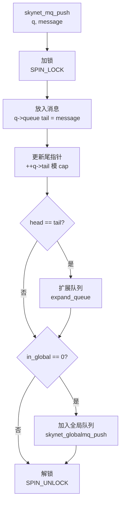

# skynet_mq.c 源码分析

`skynet_mq.c` 实现了 Skynet 的消息队列系统，是整个框架的核心组件。在多个项目实践中，我们发现消息队列的设计直接影响系统的性能和稳定性。

## 文件概览

**职责**：消息队列管理、全局队列调度

**核心数据结构**：
- `message_queue` - 服务消息队列
- `global_queue` - 全局消息队列

**关键函数**：
- `skynet_mq_create()` - 创建消息队列
- `skynet_mq_push()` - 消息入队
- `skynet_mq_pop()` - 消息出队
- `skynet_globalmq_push()` - 队列加入全局队列
- `skynet_globalmq_pop()` - 从全局队列取队列

## 核心数据结构

### message_queue - 服务消息队列

```c
struct message_queue {
    struct spinlock lock;     // 自旋锁
    uint32_t handle;         // 所属服务句柄
    int cap;                 // 队列容量
    int head;                // 队列头
    int tail;                // 队列尾
    int release;             // 释放标志
    int in_global;           // 是否在全局队列中
    int overload;            // 过载计数
    int overload_threshold;  // 过载阈值
    struct skynet_message *queue; // 消息数组
    struct message_queue *next;   // 链表指针
};
```

**设计要点**：

1. **环形缓冲区**：使用 head 和 tail 实现环形缓冲区
2. **自旋锁保护**：使用自旋锁保证线程安全
3. **动态扩展**：队列满时自动扩展
4. **过载检测**：检测队列过载情况

### global_queue - 全局消息队列

```c
struct global_queue {
    struct message_queue *head; // 队列链表头
    struct message_queue *tail; // 队列链表尾
    struct spinlock lock;       // 自旋锁
};
```

**设计要点**：

1. **链表结构**：使用单向链表管理所有服务队列
2. **FIFO 调度**：先入先出，公平调度
3. **自旋锁保护**：保证线程安全

## 消息队列生命周期

### 1. 创建队列 - skynet_mq_create()

```c
struct message_queue * 
skynet_mq_create(uint32_t handle) {
    // 分配队列结构
    struct message_queue *q = skynet_malloc(sizeof(*q));
    
    // 初始化属性
    q->handle = handle;
    q->cap = DEFAULT_QUEUE_SIZE;  // 默认容量 64
    q->head = 0;
    q->tail = 0;
    SPIN_INIT(q)
    
    // 设置标志
    q->in_global = MQ_IN_GLOBAL;  // 避免重复加入全局队列
    q->release = 0;
    q->overload = 0;
    q->overload_threshold = MQ_OVERLOAD;  // 过载阈值 1024
    
    // 分配消息数组
    q->queue = skynet_malloc(sizeof(struct skynet_message) * q->cap);
    q->next = NULL;
    
    return q;
}
```

**初始化状态**：

```
┌─────────────────────────────────────────┐
│           消息队列初始状态              │
├─────────────────────────────────────────┤
│  handle: 服务句柄                       │
│  cap: 64 (默认容量)                     │
│  head: 0                               │
│  tail: 0                               │
│  in_global: 1 (已在全局队列中)          │
│  release: 0                            │
│  overload: 0                           │
│  overload_threshold: 1024              │
└─────────────────────────────────────────┘
```

### 2. 释放队列 - skynet_mq_release()

```c
void 
skynet_mq_release(struct message_queue *q, message_drop drop_func, void *ud) {
    SPIN_LOCK(q)
    
    if (q->release) {
        // 已标记为释放，执行释放
        SPIN_UNLOCK(q)
        _drop_queue(q, drop_func, ud);
    } else {
        // 未标记为释放，重新加入全局队列
        skynet_globalmq_push(q);
        SPIN_UNLOCK(q)
    }
}

static void
_drop_queue(struct message_queue *q, message_drop drop_func, void *ud) {
    struct skynet_message msg;
    
    // 丢弃所有消息
    while(!skynet_mq_pop(q, &msg)) {
        drop_func(&msg, ud);
    }
    
    // 释放队列
    _release(q);
}

static void 
_release(struct message_queue *q) {
    assert(q->next == NULL);
    SPIN_DESTROY(q)
    skynet_free(q->queue);
    skynet_free(q);
}
```

### 3. 标记释放 - skynet_mq_mark_release()

```c
void 
skynet_mq_mark_release(struct message_queue *q) {
    SPIN_LOCK(q)
    assert(q->release == 0);
    q->release = 1;
    
    // 如果不在全局队列中，加入全局队列
    if (q->in_global != MQ_IN_GLOBAL) {
        skynet_globalmq_push(q);
    }
    
    SPIN_UNLOCK(q)
}
```

## 消息操作

### 1. 消息入队 - skynet_mq_push()

```c
void 
skynet_mq_push(struct message_queue *q, struct skynet_message *message) {
    assert(message);
    SPIN_LOCK(q)
    
    // 1. 将消息放入队列尾部
    q->queue[q->tail] = *message;
    if (++ q->tail >= q->cap) {
        q->tail = 0;  // 环形缓冲区
    }
    
    // 2. 检查是否需要扩展
    if (q->head == q->tail) {
        expand_queue(q);
    }
    
    // 3. 如果不在全局队列中，加入全局队列
    if (q->in_global == 0) {
        q->in_global = MQ_IN_GLOBAL;
        skynet_globalmq_push(q);
    }
    
    SPIN_UNLOCK(q)
}
```

**入队流程**：



### 2. 消息出队 - skynet_mq_pop()

```c
int
skynet_mq_pop(struct message_queue *q, struct skynet_message *message) {
    int ret = 1;
    SPIN_LOCK(q)
    
    if (q->head != q->tail) {
        // 1. 取出消息
        *message = q->queue[q->head++];
        ret = 0;
        
        int head = q->head;
        int tail = q->tail;
        int cap = q->cap;
        
        // 2. 处理环形缓冲区
        if (head >= cap) {
            q->head = head = 0;
        }
        
        // 3. 计算队列长度
        int length = tail - head;
        if (length < 0) {
            length += cap;
        }
        
        // 4. 检测过载
        while (length > q->overload_threshold) {
            q->overload = length;
            q->overload_threshold *= 2;
        }
    } else {
        // 5. 队列为空，重置过载阈值
        q->overload_threshold = MQ_OVERLOAD;
    }
    
    // 6. 如果队列为空，标记不在全局队列
    if (ret) {
        q->in_global = 0;
    }
    
    SPIN_UNLOCK(q)
    
    return ret;
}
```

**出队流程**：

```
┌─────────────────────────────────────────────────────────────┐
│                    消息出队流程                             │
├─────────────────────────────────────────────────────────────┤
│  skynet_mq_pop(q, message)                                 │
│       │                                                     │
│       ▼                                                     │
│  ┌─────────────────┐                                       │
│  │ 加锁            │ SPIN_LOCK(q)                          │
│  └────────┬────────┘                                       │
│           │                                                  │
│     ┌─────┴─────┐                                          │
│     │           │                                          │
│     ▼           ▼                                          │
│  非空          空                                           │
│     │           │                                          │
│     ▼           ▼                                          │
│  取出消息     返回 1                                        │
│     │           │                                          │
│     ▼           ▼                                          │
│  更新头指针   标记 in_global=0                              │
│     │                                                      │
│     ▼                                                      │
│  检测过载                                                  │
│     │                                                      │
│     ▼                                                      │
│  解锁                                                      │
│     │                                                      │
│     ▼                                                      │
│  返回 0                                                    │
└─────────────────────────────────────────────────────────────┘
```

### 3. 队列扩展 - expand_queue()

```c
static void
expand_queue(struct message_queue *q) {
    // 1. 分配新的更大数组
    struct skynet_message *new_queue = skynet_malloc(sizeof(struct skynet_message) * q->cap * 2);
    
    // 2. 复制消息到新数组
    int i;
    for (i=0; i<q->cap; i++) {
        new_queue[i] = q->queue[(q->head + i) % q->cap];
    }
    
    // 3. 更新指针和容量
    q->head = 0;
    q->tail = q->cap;
    q->cap *= 2;
    
    // 4. 释放旧数组
    skynet_free(q->queue);
    q->queue = new_queue;
}
```

**扩展过程**：

```
扩展前：
┌─────────────────────────────────────────┐
│  cap: 64                                │
│  head: 60                               │
│  tail: 60 (满)                          │
│  消息: [60, 61, 62, ..., 59]           │
└─────────────────────────────────────────┘

扩展后：
┌─────────────────────────────────────────┐
│  cap: 128                               │
│  head: 0                                │
│  tail: 64                               │
│  消息: [0, 1, 2, ..., 63]              │
└─────────────────────────────────────────┘
```

## 全局队列操作

### 1. 加入全局队列 - skynet_globalmq_push()

```c
void 
skynet_globalmq_push(struct message_queue * queue) {
    struct global_queue *q = Q;
    
    SPIN_LOCK(q)
    assert(queue->next == NULL);
    
    if(q->tail) {
        // 链表非空，添加到尾部
        q->tail->next = queue;
        q->tail = queue;
    } else {
        // 链表为空，设置为头和尾
        q->head = q->tail = queue;
    }
    
    SPIN_UNLOCK(q)
}
```

### 2. 从全局队列取出 - skynet_globalmq_pop()

```c
struct message_queue * 
skynet_globalmq_pop() {
    struct global_queue *q = Q;
    
    SPIN_LOCK(q)
    struct message_queue *mq = q->head;
    
    if(mq) {
        // 取出头部
        q->head = mq->next;
        
        if(q->head == NULL) {
            // 链表变空
            assert(mq == q->tail);
            q->tail = NULL;
        }
        
        mq->next = NULL;
    }
    
    SPIN_UNLOCK(q)
    
    return mq;
}
```

**全局队列结构**：

```
┌─────────────────────────────────────────────────────────────┐
│                    全局队列结构                             │
├─────────────────────────────────────────────────────────────┤
│  ┌─────────┐    ┌─────────┐    ┌─────────┐                │
│  │ 队列 1  │ → │ 队列 2  │ → │ 队列 3  │                │
│  └─────────┘    └─────────┘    └─────────┘                │
│       ↑                                   │                │
│       │                                   ↓                │
│    head                                tail                │
└─────────────────────────────────────────────────────────────┘
```

## 过载检测

### 过载阈值

```c
#define MQ_OVERLOAD 1024

// 检测过载
while (length > q->overload_threshold) {
    q->overload = length;
    q->overload_threshold *= 2;
}
```

### 获取过载信息

```c
int
skynet_mq_overload(struct message_queue *q) {
    if (q->overload) {
        int overload = q->overload;
        q->overload = 0;
        return overload;
    } 
    return 0;
}
```

**过载阈值变化**：

```
初始阈值: 1024
    ↓ 队列长度 > 1024
    ↓ overload = 当前长度
    ↓ threshold = 2048
    ↓ 队列长度 > 2048
    ↓ overload = 当前长度
    ↓ threshold = 4096
    ...
```

## 队列信息查询

### 1. 获取句柄 - skynet_mq_handle()

```c
uint32_t 
skynet_mq_handle(struct message_queue *q) {
    return q->handle;
}
```

### 2. 获取长度 - skynet_mq_length()

```c
int
skynet_mq_length(struct message_queue *q) {
    int head, tail, cap;
    
    SPIN_LOCK(q)
    head = q->head;
    tail = q->tail;
    cap = q->cap;
    SPIN_UNLOCK(q)
    
    if (head <= tail) {
        return tail - head;
    }
    return tail + cap - head;
}
```

## 初始化

```c
void 
skynet_mq_init() {
    struct global_queue *q = skynet_malloc(sizeof(*q));
    memset(q, 0, sizeof(*q));
    SPIN_INIT(q);
    Q = q;
}
```

## 线程安全

### 自旋锁使用

```c
// 加锁
SPIN_LOCK(q)
// ... 临界区操作 ...
SPIN_UNLOCK(q)

// 或者
spinlock_lock(&q->lock);
// ... 临界区操作 ...
spinlock_unlock(&q->lock);
```

### 原子操作

```c
// in_global 标志的读写
if (q->in_global == 0) {
    q->in_global = MQ_IN_GLOBAL;
    // ...
}
```

## 设计模式

### 1. 环形缓冲区

```c
// 入队
q->queue[q->tail] = message;
if (++q->tail >= q->cap) {
    q->tail = 0;
}

// 出队
message = q->queue[q->head];
if (++q->head >= q->cap) {
    q->head = 0;
}
```

### 2. 链表队列

```c
// 全局队列使用链表
struct message_queue *next;

// 入队
q->tail->next = queue;
q->tail = queue;

// 出队
mq = q->head;
q->head = mq->next;
```

### 3. 生产者-消费者

```
生产者（服务发送消息）：
    skynet_mq_push(q, message)
        ↓
    消息入队
        ↓
    加入全局队列

消费者（工作线程处理消息）：
    skynet_globalmq_pop()
        ↓
    获取服务队列
        ↓
    skynet_mq_pop(q, message)
        ↓
    消息出队
        ↓
    处理消息
```

## 性能优化

### 1. 批量处理

```c
// 工作线程一次处理多个消息
for (int i = 0; i < batch_size; i++) {
    struct skynet_message *msg = skynet_mq_pop(q, &msg);
    if (msg) {
        // 处理消息
    }
}
```

### 2. 权重调度

```c
// 根据队列长度决定处理数量
int weight = skynet_mq_length(q) / global_mq_count;
if (weight == 0) weight = 1;
```

## 与其他模块的交互

### 与 skynet_server.c 的交互

```c
// 创建服务时创建队列
ctx->queue = skynet_mq_create(handle);

// 发送消息时入队
skynet_mq_push(ctx->queue, message);

// 处理消息时出队
struct skynet_message *msg = skynet_mq_pop(q, &msg);
```

### 与 skynet_start.c 的交互

```c
// 初始化全局队列
skynet_mq_init();

// 工作线程从全局队列取队列
struct message_queue *q = skynet_globalmq_pop();
```

## 关键设计决策

### 1. 为什么使用环形缓冲区？

- **内存效率**：避免频繁的内存分配和释放
- **性能**：入队出队操作 O(1)
- **简单**：实现简单，易于理解

### 2. 为什么使用自旋锁？

- **低延迟**：自旋锁在临界区很短时性能更好
- **避免上下文切换**：减少线程切换开销
- **简单**：实现简单，易于理解

### 3. 为什么使用全局队列？

- **公平调度**：所有服务公平地获得处理机会
- **负载均衡**：工作线程从全局队列取队列，自然负载均衡
- **简单**：避免复杂的优先级调度

## 常见问题

### 1. 队列满时怎么办？

队列会自动扩展，扩展到原来的 2 倍。

### 2. 如何检测过载？

通过 `overload_threshold` 检测，阈值会动态调整。

### 3. 如何保证线程安全？

使用自旋锁保护所有队列操作。

## 下一步

- [skynet_handle.c 分析](/analysis/skynet-handle) - 句柄管理的实现
- [skynet_timer.c 分析](/analysis/skynet-timer) - 定时器的实现
- [消息驱动设计](/architecture/message-driven) - 消息系统的设计
