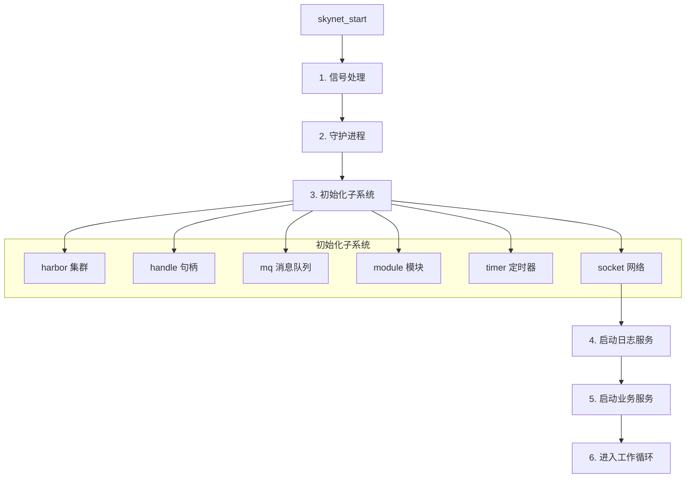
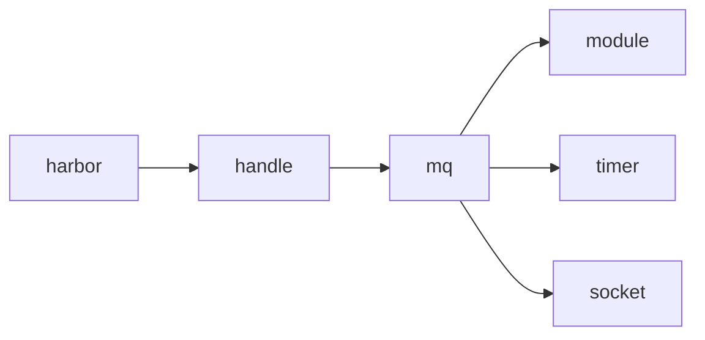

# skynet_start.c 源码分析

`skynet_start.c` 是 Skynet 的启动入口，负责初始化所有子系统、创建工作线程并进入主循环。在实际部署中，启动流程的设计直接影响服务的稳定性和可观测性。

## 整体流程

启动流程的设计思路是：**先初始化基础设施，再启动业务服务，最后进入工作循环**。



## 核心数据结构

### monitor - 监控结构

```c
struct monitor {
    int count;                      // 工作线程数
    struct skynet_monitor ** m;     // 每个线程的监控器
    pthread_cond_t cond;            // 条件变量
    pthread_mutex_t mutex;          // 互斥锁
    int sleep;                      // 睡眠线程数
    int quit;                       // 退出标志
};
```

**设计经验**：

- 每个工作线程有独立的监控器，避免锁竞争
- `sleep` 计数用于判断是否需要唤醒线程
- `quit` 标志用于优雅退出

### worker_parm - 工作线程参数

```c
struct worker_parm {
    struct monitor *m;
    int id;           // 线程 ID
    int weight;       // 权重
};
```

**设计经验**：

- 权重机制用于负载均衡，权重高的线程处理更多消息
- 权重数组设计：`[-1,-1,-1,-1, 0,0,0,0, 1,1,1,1, 2,2,2,2, 3,3,3,3]`
- 权重 -1 表示空闲时优先休眠，权重 3 表示尽量不休眠

## 子系统初始化

### skynet_start() 函数

```c
void
skynet_start(struct skynet_config * config) {
    // 1. 注册 SIGHUP 信号（用于日志轮转）
    struct sigaction sa;
    sa.sa_handler = &handle_hup;
    sa.sa_flags = SA_RESTART;
    sigfillset(&sa.sa_mask);
    sigaction(SIGHUP, &sa, NULL);
    
    // 2. 守护进程
    if (config->daemon) {
        if (daemon_init(config->daemon)) {
            exit(1);
        }
    }
    
    // 3. 初始化子系统（顺序很重要）
    skynet_harbor_init(config->harbor);    // 集群
    skynet_handle_init(config->harbor, config->thread);  // 句柄
    skynet_mq_init();                      // 消息队列
    skynet_module_init(config->module_path);  // 模块加载
    skynet_timer_init();                   // 定时器
    skynet_socket_init();                  // 网络
    skynet_profile_enable(config->profile); // 性能分析
    
    // 4. 启动日志服务（必须第一个启动）
    const uint32_t logger_handle = skynet_context_new(config->logservice, config->logger);
    if (logger_handle == 0) {
        fprintf(stderr, "Can't launch %s service\n", config->logservice);
        exit(1);
    }
    skynet_handle_namehandle(logger_handle, "logger");
    
    // 5. 启动业务服务
    bootstrap(logger_handle, config->bootstrap);
    
    // 6. 进入工作循环
    start(config->thread);
    
    // 7. 清理
    skynet_harbor_exit();
    skynet_socket_free();
    if (config->daemon) {
        daemon_exit(config->daemon);
    }
}
```

**经验总结**：

1. **初始化顺序**：handle → mq → module → timer → socket，有依赖关系
2. **日志服务优先**：确保后续初始化过程中的日志能正常输出
3. **SIGHUP 信号**：用于日志轮转，发送 SIGHUP 会通知 logger 重新打开日志文件
4. **SA_RESTART**：被信号中断的系统调用自动重启，避免 EINTR 错误

### 子系统依赖关系



## 工作线程

### thread_worker - 工作线程主循环

```c
static void *
thread_worker(void *p) {
    struct worker_parm *wp = p;
    int id = wp->id;
    int weight = wp->weight;
    struct monitor *m = wp->m;
    struct skynet_monitor *sm = m->m[id];
    
    // 初始化线程本地存储
    skynet_initthread(THREAD_WORKER);
    skynet_handle_register_thread();
    
    struct message_queue * q = NULL;
    while (!m->quit) {
        // 分发消息
        q = skynet_context_message_dispatch(sm, q, weight);
        
        if (q == NULL) {
            // 没有消息，进入休眠
            if (pthread_mutex_lock(&m->mutex) == 0) {
                ++ m->sleep;
                if (!m->quit)
                    pthread_cond_wait(&m->cond, &m->mutex);
                -- m->sleep;
                if (pthread_mutex_unlock(&m->mutex)) {
                    fprintf(stderr, "unlock mutex error");
                    exit(1);
                }
            }
        }
    }
    return NULL;
}
```

**经验总结**：

1. **线程本地存储**：`skynet_initthread` 设置线程类型，用于调试
2. **句柄注册**：`skynet_handle_register_thread` 注册分布式读锁槽位
3. **消息队列复用**：`q` 在循环外保持，避免重复从全局队列取
4. **条件变量等待**：无消息时休眠，有消息时被唤醒

### 权重机制

```c
static int weight[] = {
    -1, -1, -1, -1, 0, 0, 0, 0,
    1, 1, 1, 1, 1, 1, 1, 1,
    2, 2, 2, 2, 2, 2, 2, 2,
    3, 3, 3, 3, 3, 3, 3, 3,
};
```

**权重含义**：

| 权重 | 行为 |
|------|------|
| -1 | 空闲时优先休眠，节省 CPU |
| 0 | 默认行为 |
| 1 | 尽量不休眠，保持活跃 |
| 2 | 更积极地处理消息 |
| 3 | 最高优先级，几乎不休眠 |

**经验总结**：

- 前 4 个线程权重 -1，适合处理低优先级任务
- 后 8 个线程权重 3，适合处理高优先级任务
- 权重通过 `skynet_context_message_dispatch` 的 `weight` 参数影响调度

## 辅助线程

### thread_timer - 定时器线程

```c
static void *
thread_timer(void *p) {
    struct monitor * m = p;
    skynet_initthread(THREAD_TIMER);
    skynet_handle_register_thread();
    
    for (;;) {
        // 更新时间
        skynet_updatetime();
        skynet_socket_updatetime();
        
        CHECK_ABORT
        
        // 唤醒工作线程
        wakeup(m, m->count - 1);
        
        // 2.5ms 更新一次
        usleep(2500);
        
        // 处理 SIGHUP 信号
        if (SIG) {
            signal_hup();
            SIG = 0;
        }
    }
    
    // 退出处理
    skynet_socket_exit();
    pthread_mutex_lock(&m->mutex);
    m->quit = 1;
    pthread_cond_broadcast(&m->cond);
    pthread_mutex_unlock(&m->mutex);
    return NULL;
}
```

**经验总结**：

1. **2.5ms 精度**：定时器精度为 10ms（usleep 2500 * 4 次/10ms）
2. **唤醒策略**：`wakeup(m, m->count-1)` 唤醒除了一个之外的所有线程
3. **信号处理**：在定时器线程中处理 SIGHUP，避免竞态条件
4. **优雅退出**：先退出 socket，再设置 quit 标志，最后广播唤醒

### thread_socket - 网络线程

```c
static void *
thread_socket(void *p) {
    struct monitor * m = p;
    skynet_initthread(THREAD_SOCKET);
    skynet_handle_register_thread();
    
    for (;;) {
        int r = skynet_socket_poll();
        if (r == 0)
            break;
        if (r < 0) {
            CHECK_ABORT
            continue;
        }
        wakeup(m, 0);
    }
    return NULL;
}
```

**经验总结**：

1. **独立线程**：网络 I/O 在独立线程，不阻塞业务逻辑
2. **唤醒策略**：`wakeup(m, 0)` 最少唤醒一个线程
3. **错误处理**：`r < 0` 时检查是否需要退出

### thread_monitor - 监控线程

```c
static void *
thread_monitor(void *p) {
    struct monitor * m = p;
    int i;
    int n = m->count;
    skynet_initthread(THREAD_MONITOR);
    skynet_handle_register_thread();
    
    for (;;) {
        CHECK_ABORT
        
        // 检查每个工作线程
        for (i = 0; i < n; i++) {
            skynet_monitor_check(m->m[i]);
        }
        
        // 5 秒检查一次
        for (i = 0; i < 5; i++) {
            CHECK_ABORT
            sleep(1);
        }
    }
    return NULL;
}
```

**经验总结**：

1. **死循环检测**：检查工作线程是否卡在某个消息处理上
2. **5 秒间隔**：平衡检测精度和性能开销
3. **CHECK_ABORT**：每秒检查一次是否需要退出

## 启动服务

### bootstrap - 启动业务服务

```c
static void
bootstrap(uint32_t logger_handle, const char * cmdline) {
    int sz = strlen(cmdline);
    char name[sz+1];
    char args[sz+1];
    int arg_pos;
    
    // 解析命令行
    sscanf(cmdline, "%s", name);
    arg_pos = strlen(name);
    if (arg_pos < sz) {
        while (cmdline[arg_pos] == ' ') {
            arg_pos++;
        }
        strncpy(args, cmdline + arg_pos, sz);
    } else {
        args[0] = '\0';
    }
    
    // 创建服务
    const uint32_t handle = skynet_context_new(name, args);
    if (handle == 0) {
        // 启动失败，输出日志后退出
        struct skynet_context *logger = skynet_handle_grab(logger_handle);
        if (logger != NULL) {
            skynet_error(NULL, "Bootstrap error : %s\n", cmdline);
            skynet_context_dispatchall(logger);
            skynet_context_release(logger);
        }
        exit(1);
    }
}
```

**经验总结**：

1. **命令格式**：`服务名 参数`，空格分隔
2. **错误处理**：启动失败会输出日志再退出，便于排查
3. **dispatchall**：强制处理所有待处理的日志消息

## 线程唤醒机制

### wakeup 函数

```c
static void
wakeup(struct monitor *m, int busy) {
    if (m->sleep >= m->count - busy) {
        pthread_cond_signal(&m->cond);
    }
}
```

**唤醒策略**：

| 场景 | busy 值 | 唤醒数量 |
|------|---------|----------|
| socket 事件 | 0 | 所有睡眠线程 |
| 定时器 | count-1 | 除了一个之外的所有线程 |
| 正常情况 | 0 | 按需唤醒 |

**经验总结**：

- `pthread_cond_signal` 只唤醒一个线程
- "spurious wakeup"（虚假唤醒）是无害的
- 定时器线程保留一个线程不唤醒，避免过度唤醒

## 退出流程

```
退出流程：
    1. 定时器线程检测到 quit 标志
    2. 调用 skynet_socket_exit() 通知 socket 线程退出
    3. 设置 m->quit = 1
    4. pthread_cond_broadcast 唤醒所有工作线程
    5. 所有线程检测到 quit 标志后退出
    6. pthread_join 等待所有线程结束
    7. 清理资源
```

**经验总结**：

- 先退出 socket 线程，避免退出时还在发送数据
- 广播唤醒所有线程，确保都能退出
- join 等待所有线程，确保资源释放

## CHECK_ABORT 宏

```c
#define CHECK_ABORT if (skynet_context_total()==0) break;
```

**设计意图**：

- 当所有服务都退出时，整个系统退出
- 每个线程循环中都检查，确保及时退出
- 避免僵尸进程

## 与配置的关系

```c
struct skynet_config {
    int thread;           // 工作线程数
    int harbor;           // 集群 ID
    const char * daemon;  // 守护进程路径
    const char * module_path; // 模块路径
    const char * bootstrap;   // 启动服务
    const char * logservice;  // 日志服务
    const char * logger;      // 日志参数
    bool profile;             // 性能分析
};
```

**配置建议**：

| 配置项 | 建议值 | 说明 |
|--------|--------|------|
| thread | CPU 核心数 | 充分利用多核 |
| harbor | 0 | 单机模式 |
| daemon | NULL | 调试时不启用 |
| profile | true | 开发环境开启 |

## 常见问题

### 1. 为什么日志服务必须第一个启动？

后续初始化过程中的日志输出依赖 logger 服务。

### 2. 为什么用 usleep(2500) 而不是更精确的定时器？

usleep 开销小，2.5ms 精度对于游戏服务器足够。

### 3. 如何调整线程数？

根据 CPU 核心数和业务特点调整，一般等于 CPU 核心数。

### 4. 如何排查启动失败？

检查日志输出，bootstrap 失败会输出错误信息。

## 下一步

- [skynet_server.c 分析](/analysis/skynet-server) - 服务管理
- [skynet_mq.c 分析](/analysis/skynet-mq) - 消息队列
- [架构概览](/architecture/overview) - 整体设计
