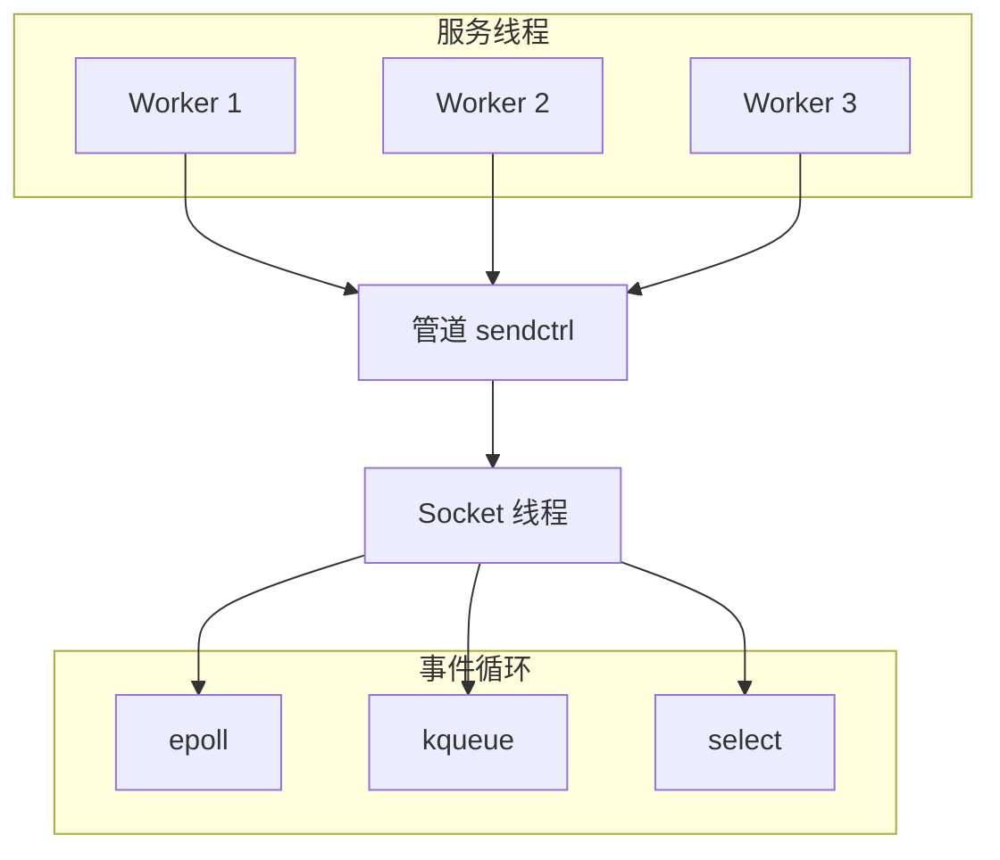
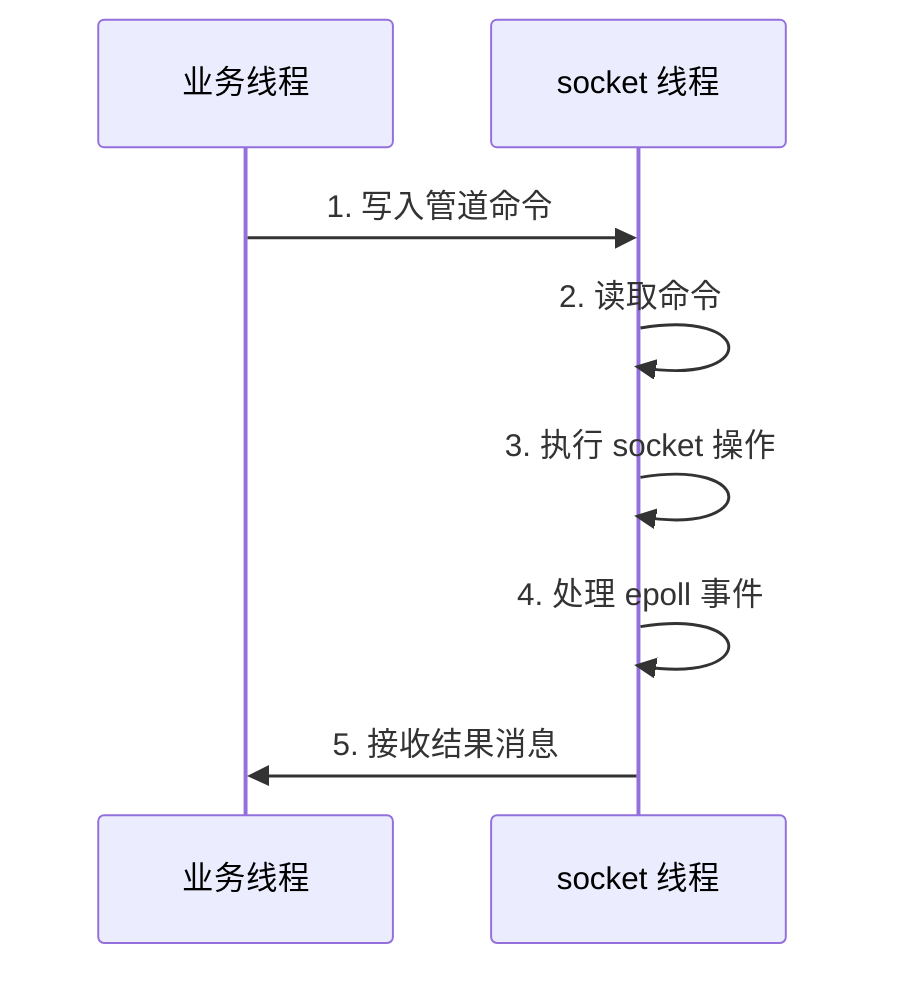
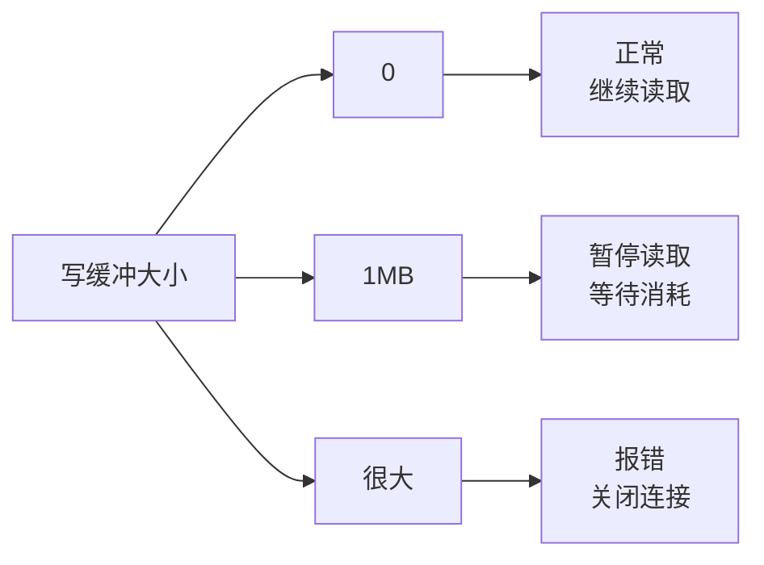
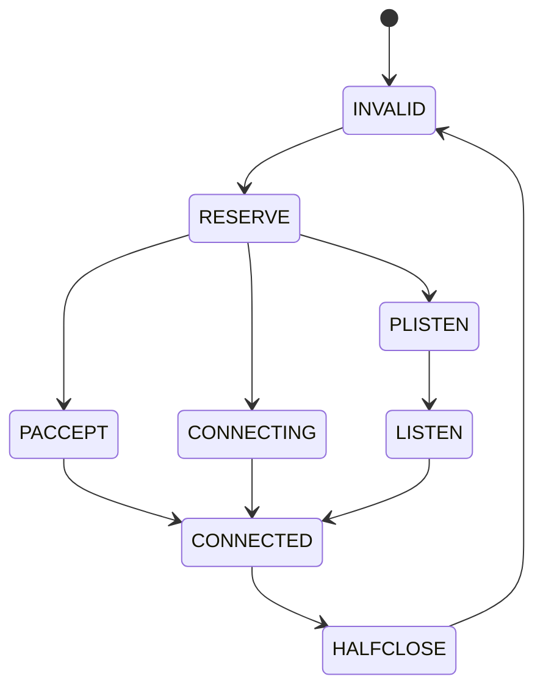

# socket_server.c 源码分析

网络 I/O 是 Skynet 的核心能力之一。`socket_server.c` 封装了底层的 socket 操作，提供了统一的异步网络接口。在实际项目中，这个模块的设计直接影响了服务器的并发能力和延迟表现。

## 整体架构

从实际使用角度看，socket_server.c 解决了几个核心问题：

1. **异步 I/O 统一**：封装 epoll/kqueue/select，屏蔽平台差异
2. **线程安全**：socket 操作在独立线程，通过管道与主线程通信
3. **内存管理**：写缓冲区管理和流量控制
4. **协议支持**：TCP/UDP 统一抽象



## 核心数据结构

### socket - 连接对象

```c
struct socket {
    uintptr_t opaque;           // 关联的服务句柄
    struct wb_list high;        // 高优先级写缓冲
    struct wb_list low;         // 低优先级写缓冲
    int64_t wb_size;           // 写缓冲总大小
    struct socket_stat stat;   // 统计信息
    ATOM_ULONG sending;        // 发送中的字节数
    int fd;                    // 文件描述符
    int id;                    // socket ID（带版本号）
    ATOM_INT type;             // socket 类型
    uint8_t protocol;          // TCP/UDP
    bool reading;              // 是否在读
    bool writing;              // 是否在写
    bool closing;              // 是否正在关闭
    // ...
};
```

**设计经验**：

- **双缓冲队列**：high/low 优先级分离，避免大消息阻塞控制消息
- **原子类型**：type 和 sending 用原子操作，减少锁竞争
- **版本号 ID**：socket ID 高位带版本号，避免 ABA 问题

### socket_server - 服务器实例

```c
struct socket_server {
    volatile uint64_t time;    // 当前时间
    int reserve_fd;            // 预留 fd（应对 EMFILE）
    int recvctrl_fd;           // 管道读端
    int sendctrl_fd;           // 管道写端
    poll_fd event_fd;          // epoll/kqueue fd
    ATOM_INT alloc_id;         // ID 分配器
    struct socket slot[MAX_SOCKET]; // socket 池
    struct event ev[MAX_EVENT];     // 事件数组
    // ...
};
```

**设计经验**：

- **预留 fd**：系统 fd 耗尽时，关闭预留 fd 再尝试 accept
- **固定大小 socket 池**：避免动态分配，O(1) 查找
- **管道通信**：socket 线程与主线程通过管道传递命令

### write_buffer - 写缓冲

```c
struct write_buffer {
    struct write_buffer *next;
    const void *buffer;
    char *ptr;
    size_t sz;
    bool userobject;
};
```

## 线程模型

Skynet 的网络 I/O 运行在独立线程中，与业务线程分离。这个设计避免了网络 I/O 阻塞业务逻辑。

### 通信机制



### 命令协议

通过管道传递的命令类型：

```c
// 命令类型
'R'  // Resume - 恢复 socket
'S'  // Pause - 暂停 socket
'B'  // Bind - 绑定 fd
'L'  // Listen - 监听
'K'  // Close - 关闭
'O'  // Open - 连接
'W'  // Write - 启用写
'D'  // Send high - 高优先级发送
'P'  // Send low - 低优先级发送
'A'  // UDP send
'T'  // Setopt - 设置选项
'U'  // UDP create
```

## 核心流程

### 1. 创建 socket_server

```c
struct socket_server * 
socket_server_create(uint64_t time) {
    // 创建 epoll/kqueue
    poll_fd efd = sp_create();
    
    // 创建管道
    int fd[2];
    pipe(fd);
    
    // 将管道读端加入 epoll
    sp_add(efd, fd[0], NULL);
    
    // 分配结构
    struct socket_server *ss = MALLOC(sizeof(*ss));
    ss->event_fd = efd;
    ss->recvctrl_fd = fd[0];
    ss->sendctrl_fd = fd[1];
    ss->reserve_fd = dup(1);  // 预留 fd
    
    // 初始化 socket 池
    for (i = 0; i < MAX_SOCKET; i++) {
        struct socket *s = &ss->slot[i];
        ATOM_INIT(&s->type, SOCKET_TYPE_INVALID);
        // ...
    }
    
    return ss;
}
```

**经验总结**：

- 预留 fd 是为了应对 `EMFILE` 错误（fd 耗尽）
- 管道用于线程间通信，比 mutex + condition 更高效

### 2. 主循环 - socket_server_poll

```c
int
socket_server_poll(struct socket_server *ss, struct socket_message *result, int *more) {
    for (;;) {
        // 1. 检查管道命令
        if (ss->checkctrl) {
            if (has_cmd(ss)) {
                int type = ctrl_cmd(ss, result);
                if (type != -1) {
                    return type;
                }
            }
        }
        
        // 2. 处理 epoll 事件
        if (ss->event_index == ss->event_n) {
            ss->event_n = sp_wait(ss->event_fd, ss->ev, MAX_EVENT);
            ss->event_index = 0;
        }
        
        // 3. 分发事件
        struct event *e = &ss->ev[ss->event_index++];
        struct socket *s = e->s;
        
        switch (ATOM_LOAD(&s->type)) {
        case SOCKET_TYPE_CONNECTING:
            return report_connect(ss, s, &l, result);
        case SOCKET_TYPE_LISTEN:
            return report_accept(ss, s, result);
        default:
            if (e->read) {
                return forward_message_tcp(ss, s, &l, result);
            }
            if (e->write) {
                return send_buffer(ss, s, &l, result);
            }
        }
    }
}
```

**经验总结**：

- 命令优先于事件处理，保证控制命令及时响应
- 事件批量处理（MAX_EVENT=64），减少 epoll_wait 调用
- `SOCKET_MORE` 表示还有数据未读完，需要继续读

### 3. 发送数据

```c
int
socket_server_send(struct socket_server *ss, struct socket_sendbuffer *buf) {
    struct socket *s = &ss->slot[HASH_ID(buf->id)];
    
    // 检查 socket 有效性
    if (socket_invalid(s, buf->id)) {
        free_buffer(ss, buf);
        return -1;
    }
    
    // 已有数据在发送，加入队列
    if (s->wb_size > 0) {
        append_sendbuffer(ss, s, buf);
        return 0;
    }
    
    // 尝试直接发送
    int n = write(s->fd, buf->buffer, buf->sz);
    if (n < 0) {
        // EAGAIN: 加入队列，等待可写
        append_sendbuffer(ss, s, buf);
        sp_write(ss, s->fd, s, true);
        return 0;
    }
    
    if (n == buf->sz) {
        // 全部发送完成
        return 0;
    }
    
    // 部分发送，剩余加入队列
    append_sendbuffer_tail(ss, s, buf, n);
    sp_write(ss, s->fd, s, true);
    return 0;
}
```

**经验总结**：

- 优先尝试直接发送，减少系统调用
- `wb_size` 超过阈值会触发背压（暂停读取）
- 写缓冲使用链表，支持部分发送

### 4. 接收数据

```c
static int
forward_message_tcp(struct socket_server *ss, struct socket *s, struct socket_lock *l, struct socket_message *result) {
    int sz = s->p.size;
    char *buffer;
    
    if (sz == 0) {
        sz = MIN_READ_BUFFER;
    }
    
    buffer = MALLOC(sz);
    int n = read(s->fd, buffer, sz);
    
    if (n < 0) {
        FREE(buffer);
        if (errno == EAGAIN) {
            return -1;
        }
        return report_error(s, result, strerror(errno));
    }
    
    if (n == 0) {
        FREE(buffer);
        return report_close(s, result);
    }
    
    // 动态调整缓冲区大小
    if (n == sz) {
        s->p.size = sz * 2;
    } else if (sz > MIN_READ_BUFFER && n * 2 < sz) {
        s->p.size = sz / 2;
    }
    
    result->opaque = s->opaque;
    result->id = s->id;
    result->ud = n;
    result->data = buffer;
    
    return SOCKET_DATA;
}
```

**经验总结**：

- 缓冲区动态调整：读满则扩大，读少则缩小
- 最小缓冲区 64 字节，避免频繁分配
- 返回 `SOCKET_MORE` 表示还有数据，触发继续读取

## 流量控制

### 写缓冲水位

```c
#define WARNING_SIZE (1024*1024)  // 1MB

// 检查是否需要暂停读取
if (s->wb_size >= WARNING_SIZE) {
    // 暂停读取，等待写缓冲消耗
    sp_read(ss, s->fd, s, false);
    s->reading = false;
}
```

### 背压机制



**经验总结**：

- 背压通过暂停读取实现，不是丢弃数据
- 1MB 阈值是经验值，可根据业务调整
- 写缓冲消耗后会自动恢复读取

## socket 类型状态机



### 各状态含义

| 状态 | 含义 |
|------|------|
| INVALID | 无效，未使用 |
| RESERVE | 已分配 ID，未绑定 fd |
| PLISTEN | 准备监听 |
| LISTEN | 监听中 |
| CONNECTING | 连接中 |
| CONNECTED | 已连接 |
| HALFCLOSE_READ | 半关闭（读） |
| HALFCLOSE_WRITE | 半关闭（写） |
| PACCEPT | 被动 accept |
| BIND | 绑定外部 fd |

## 事件处理

### epoll 事件映射

```c
// socket_poll.h (Linux)
struct event {
    struct socket *s;
    bool read;
    bool write;
    bool error;
    bool eof;
};

// 从 epoll_event 映射
static void
sp_epoll_event(struct event *e, struct epoll_event *ee) {
    e->read = (ee->events & EPOLLIN) != 0;
    e->write = (ee->events & EPOLLOUT) != 0;
    e->error = (ee->events & EPOLLERR) != 0;
    e->eof = (ee->events & EPOLLHUP) != 0;
}
```

### 事件优先级

```
处理顺序：
1. 管道命令（最高优先级）
2. 连接事件（CONNECTING/CONNECTED）
3. 读事件
4. 写事件
5. 错误事件
6. EOF 事件
```

## UDP 支持

### UDP socket 创建

```c
static int
udp_socket(struct socket_server *ss, struct request_udp *udp, struct socket_message *result) {
    int fd = socket(udp->family, SOCK_DGRAM, 0);
    
    // 绑定到 epoll
    sp_add(ss->event_fd, fd, s);
    
    // 初始化 socket
    s->fd = fd;
    s->protocol = PROTOCOL_UDP;
    s->type = SOCKET_TYPE_CONNECTED;
    
    return SOCKET_UDP;
}
```

### UDP 发送

```c
static int
send_socket_udp(struct socket_server *ss, struct socket *s, struct write_buffer_udp *wu, struct socket_message *result) {
    union sockaddr_all sa;
    
    // 解析地址
    if (udp_socket_address(s, wu, &sa)) {
        int n = sendto(s->fd, wu->buffer.buffer, wu->buffer.sz, 0, &sa.s, sizeof(sa));
        // ...
    }
}
```

## 错误处理

### EMFILE 处理

```c
static int
report_accept(struct socket_server *ss, struct socket *s, struct socket_message *result) {
    int fd = accept(s->fd, ...);
    
    if (fd < 0) {
        if (errno == EMFILE) {
            // fd 耗尽，关闭预留 fd，重试
            close(ss->reserve_fd);
            fd = accept(s->fd, ...);
            ss->reserve_fd = dup(1);
        }
        // ...
    }
}
```

**经验总结**：

- `EMFILE` 是常见的生产问题，预留 fd 是标准应对方案
- accept 后立即设置非阻塞，避免阻塞 socket 线程

### 连接错误

```c
static int
report_connect(struct socket_server *ss, struct socket *s, struct socket_lock *l, struct socket_message *result) {
    int error;
    socklen_t len = sizeof(error);
    int code = getsockopt(s->fd, SOL_SOCKET, SO_ERROR, &error, &len);
    
    if (code < 0 || error) {
        return report_error(s, result, strerror(error));
    }
    
    // 连接成功
    s->type = SOCKET_TYPE_CONNECTED;
    return SOCKET_OPEN;
}
```

## 性能优化

### 1. 批量事件处理

```c
#define MAX_EVENT 64

// 一次 epoll_wait 最多返回 64 个事件
ss->event_n = sp_wait(ss->event_fd, ss->ev, MAX_EVENT);
```

### 2. 延迟关闭

```c
// 不立即关闭，标记为 closing
s->closing = true;

// 等待写缓冲消耗完再关闭
if (s->wb_size == 0) {
    force_close(ss, s, l, result);
}
```

### 3. 零拷贝发送

```c
// SOCKET_BUFFER_OBJECT 类型支持零拷贝
if (sz == USEROBJECT) {
    // 使用用户对象的 free_func
    so->free_func = ss->soi.free;
}
```

## 与 skynet_socket.c 的关系

`socket_server.c` 是底层实现，`skynet_socket.c` 是上层封装：

```c
// skynet_socket.c
void 
skynet_socket_start(struct skynet_context *ctx, int id) {
    struct request_package request;
    int len = start_socket(ss, &request, id, (uintptr_t)ctx);
    send_request(ss, &request, 'S', len);
}
```

**经验总结**：

- `skynet_socket.c` 负责与服务交互
- `socket_server.c` 负责底层 I/O
- 两层分离，职责清晰

## 常见问题

### 1. 为什么用管道而不是共享队列？

管道天然支持 epoll 监听，不需要额外的唤醒机制。

### 2. 为什么 socket 池固定大小？

避免动态分配，O(1) 查找，MAX_SOCKET=65536 足够大多数场景。

### 3. 如何处理大量并发连接？

epoll + 非阻塞 I/O + 事件驱动，单线程可处理数万连接。

## 下一步

- [socket 模块](/analysis/socket-lua) - 上层封装
- [网络 I/O 设计](/architecture/network-io) - 架构设计
- [Gate 服务](/analysis/gate-service) - 网关实现
