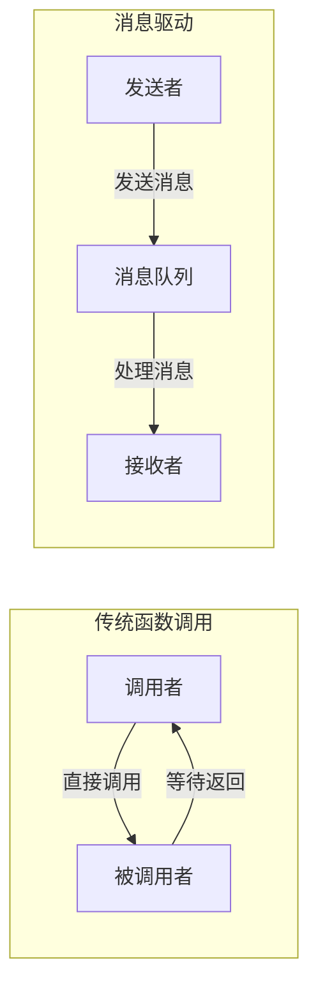
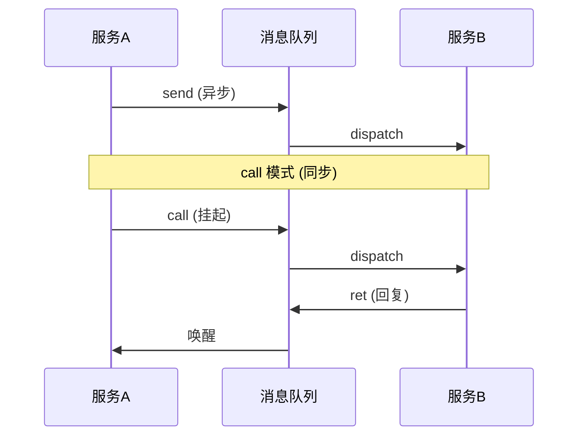
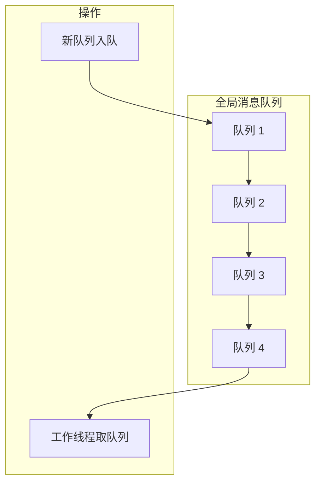
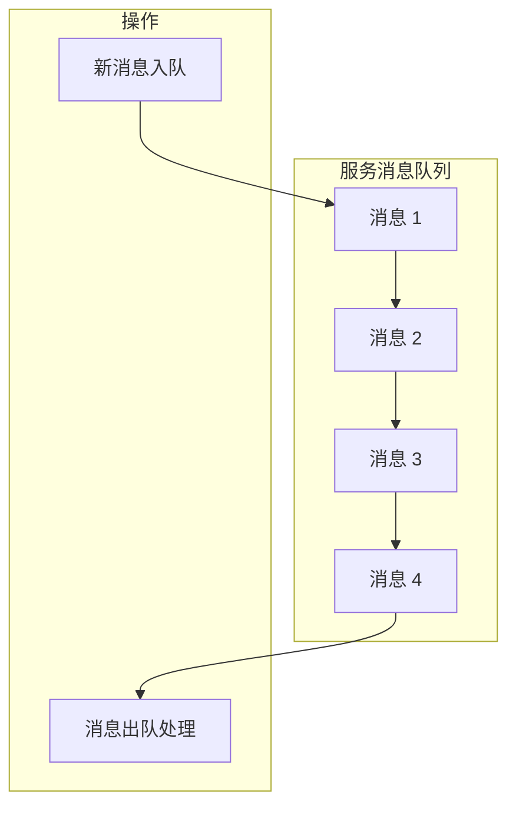

# 消息驱动设计

消息驱动是 Skynet 的核心设计理念之一。在多个项目实践中，我们发现理解消息系统是正确使用 Skynet 的关键。

## 消息驱动的概念

在消息驱动架构中，有几个核心特点：

- **一切皆消息**：所有的交互都通过消息完成，包括服务间通信、定时器、网络事件等
- **异步处理**：消息发送后立即返回，不等待处理完成，提高了系统的并发能力
- **事件循环**：系统不断从消息队列取消息并处理，这是 Skynet 运行的基础

### 消息驱动 vs 函数调用



## Skynet 消息系统

### 消息结构

```c
struct skynet_message {
    uint32_t source;    // 消息来源（服务句柄）
    int session;        // 会话 ID
    void *data;         // 消息数据
    size_t sz;          // 消息大小
};
```

### 消息类型

Skynet 支持多种消息类型：

```lua
-- 消息类型常量
local PTYPE_TEXT = 0      -- 文本消息
local PTYPE_RESPONSE = 1  -- 响应消息
local PTYPE_ERROR = 2     -- 错误消息
local PTYPE_LUA = 3       -- Lua 消息
local PTYPE_SNAP = 4      -- 快照消息
```

### 消息流向



## 核心消息操作

### 1. 发送消息 (skynet.send)

单向发送消息，不等待回复：

```lua
local skynet = require "skynet"

-- 发送消息
skynet.send(target, type, ...)
```

**特点**：
- 异步操作，立即返回
- 不保证消息被处理
- 适用于通知、广播等场景

**示例**：
```lua
-- 通知所有在线玩家
for _, player in pairs(online_players) do
    skynet.send(player.address, "lua", "server_announcement", message)
end
```

### 2. 调用消息 (skynet.call)

发送消息并等待回复：

```lua
local skynet = require "skynet"

-- 发送消息并等待回复
local result = skynet.call(target, type, ...)
```

**特点**：
- 同步操作（实际上是协程挂起）
- 等待目标处理完成并返回结果
- 适用于查询、请求等场景

**示例**：
```lua
-- 查询玩家信息
local player_info = skynet.call(player_service, "lua", "get_info", player_id)

-- 调用数据库服务
local data = skynet.call(db_service, "lua", "query", sql)
```

### 3. 响应消息 (skynet.ret)

回复调用方的消息：

```lua
local skynet = require "skynet"

skynet.dispatch("lua", function(session, address, cmd, ...)
    -- 处理消息
    local result = process(cmd, ...)
    
    -- 返回结果
    skynet.ret(skynet.pack(result))
end)
```

**特点**：
- 必须在 skynet.dispatch 回调中使用
- 使用 skynet.pack 打包返回值
- 会自动设置 session 以匹配请求

### 4. 忽略响应 (skynet.response)

对于不需要回复的消息：

```lua
skynet.dispatch("lua", function(session, address, cmd, ...)
    if cmd == "fire_and_forget" then
        -- 忽略响应
        skynet.response()
        return
    end
    
    -- 正常处理
    skynet.ret(skynet.pack(result))
end)
```

## 消息队列机制

### 全局消息队列



**经验总结**：
- 全局队列是一个链表结构，支持快速入队和出队
- 工作线程从队列头部取服务队列
- 新消息到达时，服务队列从尾部入队

### 服务消息队列



**经验总结**：
- 每个服务有独立的消息队列
- 消息按 FIFO 顺序处理
- 队列为空时，服务进入休眠状态

### 消息调度流程

```c
// skynet_mq.c 中的关键函数

// 消息入队
void skynet_mq_push(struct message_queue *q, struct skynet_message *message) {
    spinlock_lock(&q->lock);
    
    // 检查队列是否已满
    if (q->in_global == 0) {
        // 将队列加入全局队列
        globalmq_push(q);
        q->in_global = 1;
    }
    
    // 将消息放入队列
    q->queue[q->tail] = *message;
    q->tail = (q->tail + 1) % q->cap;
    
    spinlock_unlock(&q->lock);
}

// 消息出队
int skynet_mq_pop(struct message_queue *q, struct skynet_message *message) {
    spinlock_lock(&q->lock);
    
    if (q->head == q->tail) {
        // 队列为空
        q->in_global = 0;
        spinlock_unlock(&q->lock);
        return 0;
    }
    
    // 取出消息
    *message = q->queue[q->head];
    q->head = (q->head + 1) % q->cap;
    
    spinlock_unlock(&q->lock);
    return 1;
}
```

## 消息处理流程

### 工作线程处理消息

```c
// skynet_start.c 中的工作线程

static void *thread_worker(void *p) {
    struct worker_parm *wp = p;
    int id = wp->id;
    
    while (!skynet_context_total()) {
        // 从全局队列取消息队列
        struct message_queue *q = globalmq_pop();
        
        if (q) {
            // 处理队列中的消息
            struct skynet_message msg;
            if (skynet_mq_pop(q, &msg)) {
                // 找到对应的服务并处理消息
                struct skynet_context *ctx = skynet_handle_grab(msg.source);
                if (ctx) {
                    ctx->cb(ctx, ctx->cb_ud, msg.type, msg.session, 
                           msg.source, msg.data, msg.sz);
                    skynet_context_release(ctx);
                }
            }
        }
    }
    
    return NULL;
}
```

### Lua 层消息处理

```lua
-- skynet.lua 中的消息处理

function skynet.dispatch(type, func)
    -- 注册消息处理函数
    local prototype = assert(proto[type])
    prototype.dispatch = func
end

function skynet.dispatch_message(...)
    -- 分发消息到对应的处理函数
    local p = proto[pt]
    if p.dispatch then
        p.dispatch(session, source, ...)
    end
end
```

## 消息模式

### 1. 请求-响应模式

最常见的模式，客户端发送请求，服务端返回响应：

```lua
-- 客户端
local result = skynet.call(service, "lua", "query", key)

-- 服务端
skynet.dispatch("lua", function(session, address, cmd, key)
    if cmd == "query" then
        local value = get_value(key)
        skynet.ret(skynet.pack(value))
    end
end)
```

### 2. 单向通知模式

发送消息但不等待回复：

```lua
-- 发送通知
skynet.send(player, "lua", "update_score", new_score)

-- 接收通知
skynet.dispatch("lua", function(session, address, cmd, ...)
    if cmd == "update_score" then
        local score = ...
        update_ui(score)
    end
end)
```

### 3. 广播模式

向多个服务发送相同消息：

```lua
-- 广播给所有在线玩家
for _, player in pairs(online_players) do
    skynet.send(player.address, "lua", "broadcast", message)
end
```

### 4. 请求转发模式

将请求转发给其他服务处理：

```lua
skynet.dispatch("lua", function(session, address, cmd, ...)
    if cmd == "complex_query" then
        -- 转发给专门的服务处理
        local result = skynet.call(analytics_service, "lua", cmd, ...)
        skynet.ret(skynet.pack(result))
    end
end)
```

## 消息与协程

### 协程挂起与恢复

当调用 `skynet.call()` 时，当前协程会挂起：

```lua
function handle_request()
    -- 协程在此挂起，等待回复
    local result = skynet.call(service, "lua", "query", key)
    
    -- 收到回复后，协程恢复执行
    process_result(result)
end
```

### 并发请求

可以同时发起多个请求：

```lua
function fetch_multiple()
    -- 同时发起多个请求
    local co1 = skynet.fcall(service1, "lua", "query1")
    local co2 = skynet.fcall(service2, "lua", "query2")
    local co3 = skynet.fcall(service3, "lua", "query3")
    
    -- 等待所有结果
    local result1 = skynet.wait(co1)
    local result2 = skynet.wait(co2)
    local result3 = skynet.wait(co3)
    
    return result1, result2, result3
end
```

## 消息调试

### 消息追踪

```lua
-- 开启消息追踪
skynet.trace("msg")

-- 所有消息都会被记录
skynet.send(service, "lua", "test")
-- 输出: [TRACE] msg send :00000001 -> :00000002 lua test
```

### 消息统计

```lua
-- 获取服务的消息队列长度
local queue_len = skynet.call(service, "debug", "QUEUE")
```

## 最佳实践

### 1. 消息设计原则

```lua
-- 好：明确的消息类型和参数
skynet.call(player, "lua", "update_hp", player_id, new_hp)
skynet.call(player, "lua", "get_info", player_id)

-- 差：模糊的消息
skynet.call(player, "lua", "update", "hp", new_hp)
skynet.call(player, "lua", "get", "info")
```

### 2. 错误处理

```lua
-- 使用 pcall 处理可能的错误
local ok, result = pcall(function()
    return skynet.call(service, "lua", "risky_operation")
end)

if not ok then
    -- 处理错误
    log("Error: " .. tostring(result))
end
```

### 3. 超时处理

```lua
-- 使用 skynet.timeout 实现超时
local co = skynet.fcall(service, "lua", "slow_query")
local timeout = false

skynet.timeout(100, function()
    timeout = true
    skynet.wakeup(co)
end)

local result = skynet.wait(co)

if timeout then
    log("Request timeout")
end
```

## 下一步

- [消息队列实现](/architecture/message-queue) - 深入消息队列的实现细节
- [服务调度](/architecture/service-scheduling) - 理解工作线程如何调度消息
- [skynet_mq.c 分析](/analysis/skynet-mq) - 消息队列的源码分析
