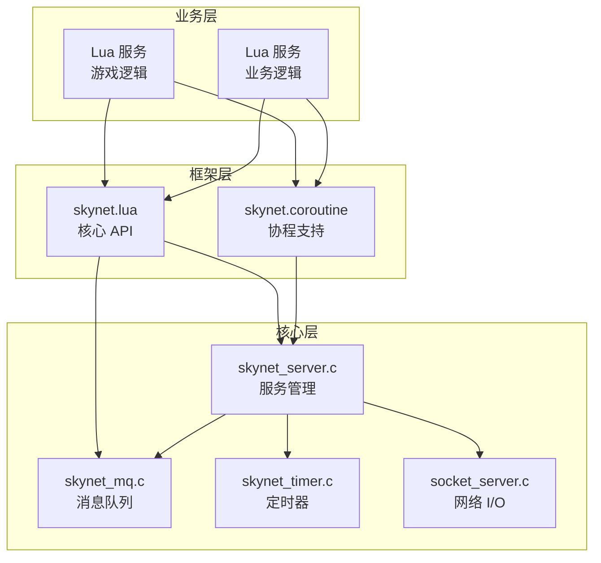
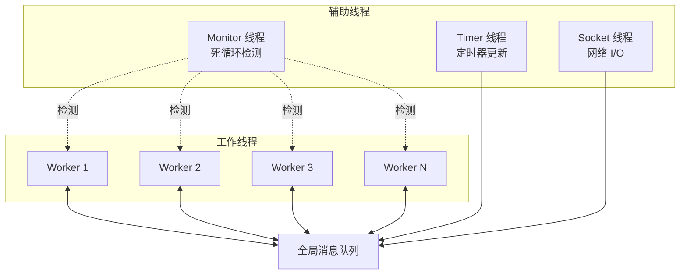
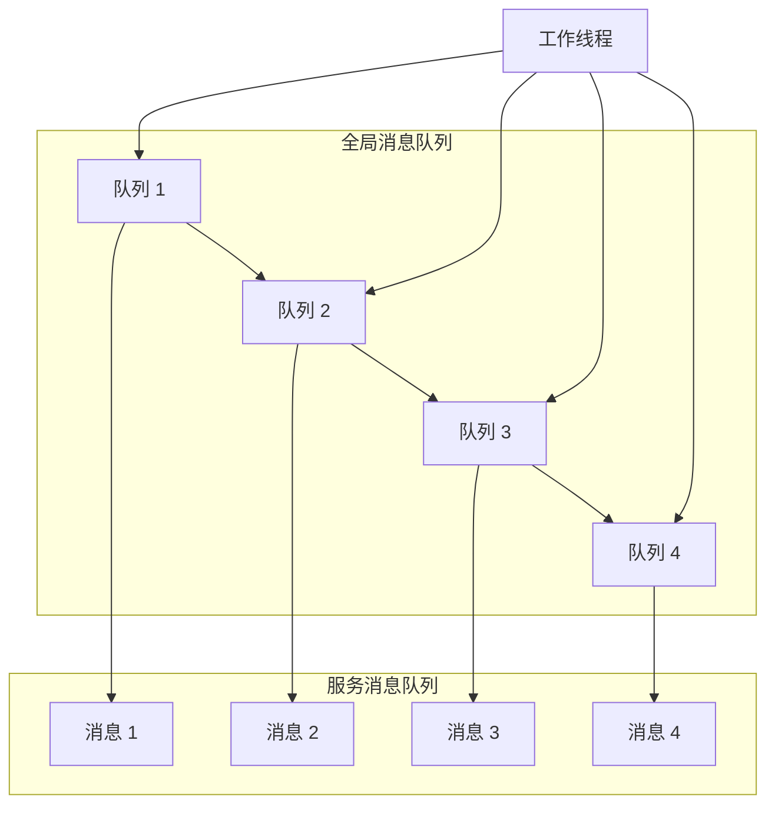
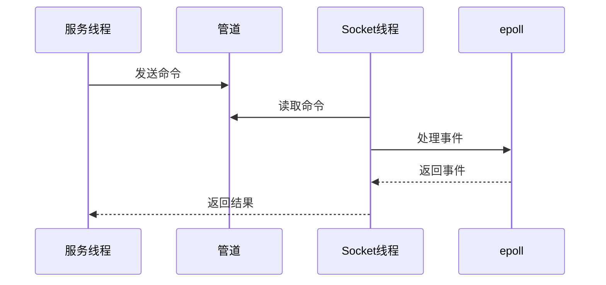
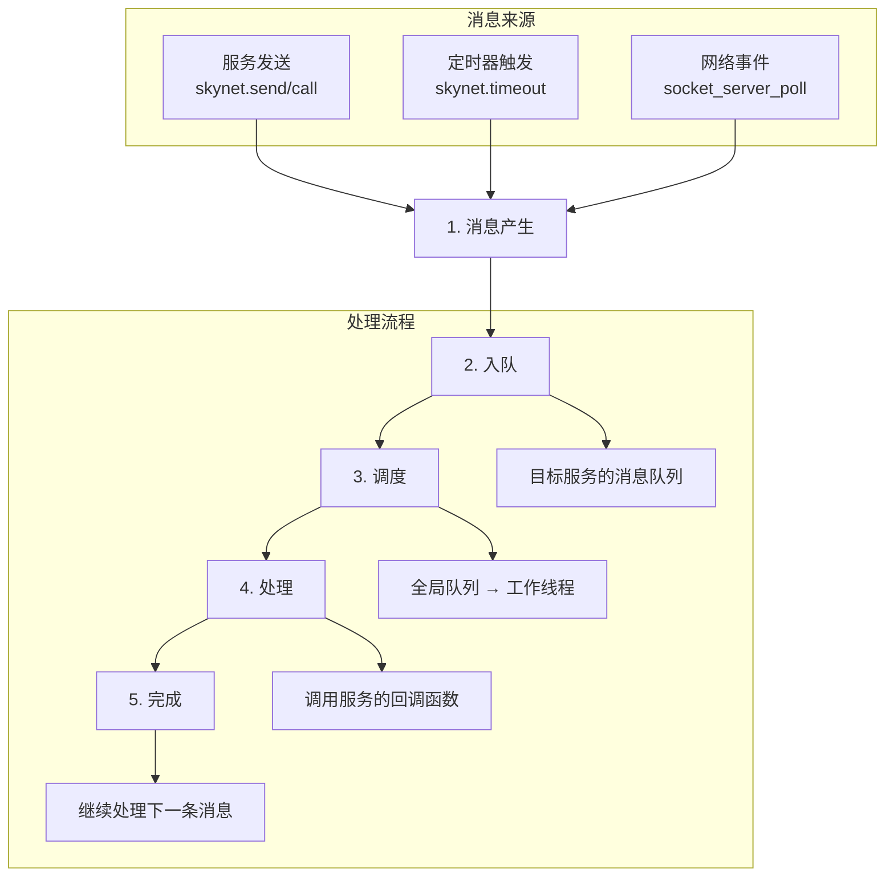
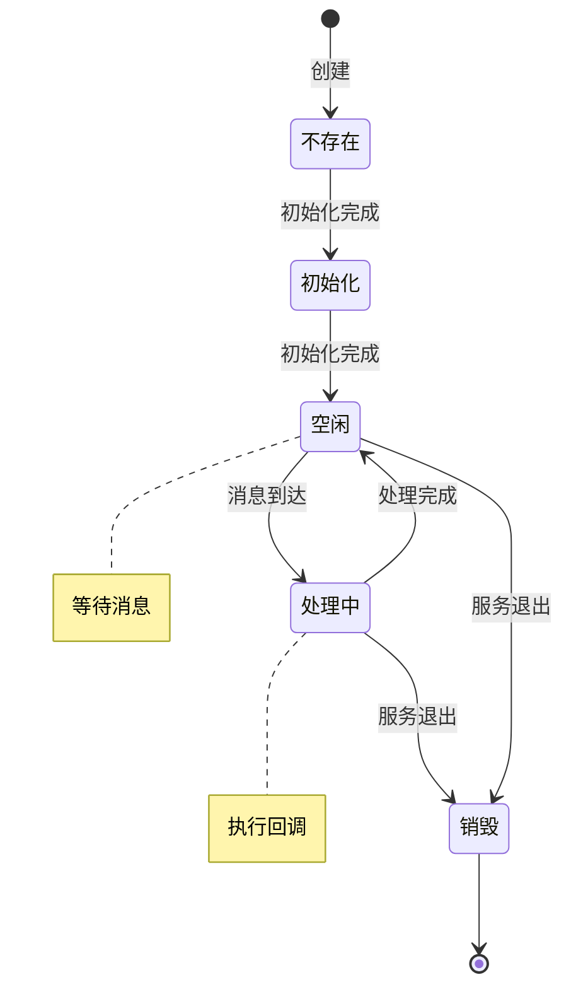

# 架构概览

回顾 Skynet 的架构设计，核心理念其实很简单：**消息驱动 + Actor 模型**。这种设计不是凭空想出来的，而是游戏服务器场景下的自然选择。

## 设计哲学

### 消息驱动

在实际项目中，我们发现消息驱动解决了几个关键问题：

1. **解耦**：服务之间只通过消息交互，改一个服务不会影响其他服务
2. **可追溯**：所有交互都有消息记录，出问题时容易排查
3. **异步友好**：消息天然支持异步，不会阻塞调用方

```lua
-- 发送消息，不等待回复
skynet.send(target, "lua", "update", data)

-- 发送消息，等待回复
local result = skynet.call(target, "lua", "query", key)
```

### 服务隔离

每个服务都是独立的，拥有自己的：
- 消息队列
- 执行上下文
- 状态数据

这种设计避免了共享内存带来的锁竞争问题。在实际项目中，我们遇到过很多因为共享状态导致的 bug，Skynet 的设计从根本上避免了这类问题。

### 同步编程体验

虽然底层是异步的，但通过 Lua 协程，可以用同步的方式写代码：

```lua
-- 看起来是同步的，实际上是异步的
local result = skynet.call("service_name", "lua", "query", data)
-- 这里会挂起，直到收到回复
process(result)
```

这种设计降低了异步编程的心智负担，开发者不需要写回调函数。

## 核心架构

### 分层设计

从实际项目经验看，分层设计让代码更容易维护：



**经验总结**：

- 业务层用 Lua，开发效率高，支持热更新
- 框架层封装常用的编程模式，降低开发门槛
- 核心层用 C，性能高，稳定性好

### 线程模型

Skynet 的线程模型是 **多线程 + 消息驱动**，不是传统的多线程模型：



**经验总结**：

- Worker 线程：处理业务消息，数量可配置（通常等于 CPU 核心数）
- Timer 线程：更新定时器，2.5ms 精度
- Socket 线程：处理网络 I/O，独立线程避免阻塞业务
- Monitor 线程：检测死循环，5 秒检查一次

## 核心组件

### 消息队列

消息队列是 Skynet 的核心，设计简单但高效：



**设计特点**：

- 每个服务一个消息队列，避免锁竞争
- 全局队列负责调度，保证公平性
- 环形缓冲区实现，内存效率高

### 服务调度

工作线程从全局队列取服务队列，处理其中的消息：

```c
// 工作线程主循环
while (!quit) {
    // 从全局队列取服务队列
    q = skynet_context_message_dispatch(sm, q, weight);
    
    if (q == NULL) {
        // 没有消息，休眠等待
        pthread_cond_wait(&cond, &mutex);
    }
}
```

**调度策略**：

- 权重机制：不同线程有不同的优先级
- 唤醒策略：有消息时唤醒最少一个线程
- 休眠策略：无消息时休眠，节省 CPU

### 定时器

基于时间轮的定时器，支持毫秒级精度：

```mermaid
graph TB
    subgraph 时间轮
        direction TB
        subgraph 近期定时器 near[256]
            N0[0]
            N1[1]
            N2[2]
            N255[255]
        end
        
        subgraph 远期定时器 t[4][64]
            L0[Level 0<br/>256-16383]
            L1[Level 1<br/>16384-1048575]
            L2[Level 2<br/>1048576-67108863]
            L3[Level 3<br/>67108864+]
        end
    end
    
    L0 --> N0
    L1 --> L0
    L2 --> L1
    L3 --> L2
```

**设计特点**：

- O(1) 添加定时器
- O(1) 推进时间
- 分级存储，内存效率高

### 网络 I/O

基于 epoll/kqueue 的异步 I/O，独立线程处理：



**设计特点**：

- 独立线程，不阻塞业务
- 管道通信，避免锁竞争
- 批量事件处理，减少系统调用

## 消息生命周期

一个消息从产生到被处理，经历这些阶段：



## 服务状态机

一个服务在其生命周期中的状态转换：



## 关键设计决策

回顾 Skynet 的设计，有几个关键决策值得思考：

### 1. 为什么选择 Actor 模型？

游戏服务器的特点是：
- 大量独立实体（玩家、NPC、怪物）
- 实体之间需要频繁交互
- 需要高并发处理

Actor 模型完美契合这些需求，每个实体可以是一个 Actor，消息传递避免了共享状态的复杂性。

### 2. 为什么用 Lua？

- **轻量级**：Lua VM 开销小，可以为每个服务创建独立的 VM
- **协程支持**：Lua 协程让异步编程变得简单
- **热更新**：可以在运行时替换代码
- **开发效率**：Lua 语法简洁，开发效率高

### 3. 为什么用 C 实现核心？

- **性能**：消息队列、调度器等核心组件需要极致性能
- **控制力**：需要精确控制内存、线程等资源
- **稳定性**：核心逻辑相对固定，用 C 实现更稳定

### 4. 为什么每个服务有独立的消息队列？

- **隔离性**：服务之间互不干扰
- **公平调度**：每个服务公平地获得处理机会
- **简化设计**：避免复杂的锁竞争

## 与其他架构的对比

| 特性 | Skynet | 传统多线程 | Go | Erlang |
|------|--------|-----------|-----|--------|
| 并发模型 | Actor | 线程 | Goroutine | Actor |
| 共享状态 | 无 | 有 | 有限 | 无 |
| 内存模型 | 独立 | 共享 | 共享 | 独立 |
| 热更新 | 支持 | 困难 | 困难 | 支持 |
| 学习曲线 | 中等 | 低 | 低 | 高 |
| 适用场景 | 游戏服务器 | 通用 | 通用 | 电信 |

## 实践经验

### 1. 服务粒度

在实际项目中，服务粒度的选择很重要：

- **太粗**：单个服务负载过重，难以扩展
- **太细**：消息通信开销大，增加复杂度
- **合适**：一个服务负责一个独立的功能

### 2. 消息设计

消息设计的好坏直接影响系统的可维护性：

- **明确**：消息类型清晰，参数明确
- **简洁**：避免传递大量数据
- **可扩展**：预留扩展字段

### 3. 错误处理

消息驱动系统的错误处理需要特别注意：

- **消息丢失**：确保消息不会丢失
- **超时处理**：设置合理的超时时间
- **错误传播**：错误信息能正确传递

## 下一步

- [Actor 模型](/architecture/actor-model) - 深入理解 Actor 模型的实现
- [消息驱动设计](/architecture/message-driven) - 消息系统的设计细节
- [服务与模块](/architecture/service-module) - 服务的创建和管理
