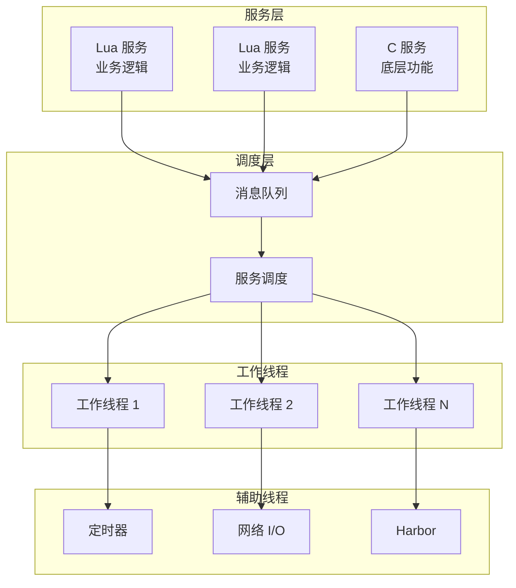

# 概述

Skynet 是我们团队在游戏服务器开发中常用的框架。经过多个项目的实践，我们认为它的设计思路值得学习和参考。

## Skynet 是什么

Skynet 是云风开发的轻量级游戏服务器框架，在国内游戏行业有广泛的应用。从实际使用角度看，它的核心设计可以概括为 **Actor 模型** + **消息驱动**。

### 核心特性

在实际项目中，我们发现这些特性特别有价值：

- **Actor 模型**：每个服务都是独立的 Actor，通过消息传递通信，避免了共享状态的复杂性
- **消息驱动**：所有逻辑都在消息处理中完成，系统行为可追溯
- **轻量级**：C 核心 + Lua 脚本的分层架构，兼顾性能和开发效率
- **高性能**：基于 epoll/kqueue 的异步 I/O，单机可处理大量连接
- **热更新**：Lua 服务支持不停服更新，线上问题修复更灵活
- **集群支持**：通过 Harbor 机制实现分布式部署，支持水平扩展

## 架构概览



## 核心组件

### 消息队列 (skynet_mq.c)
每个服务都有一个独立的消息队列，服务之间通过向对方的消息队列发送消息来通信。全局消息队列负责调度各个服务的消息队列。

### 服务调度 (skynet_server.c)
多工作线程从全局队列中获取服务队列，处理其中的消息。调度器确保消息被公平地分发到各个工作线程。

### 定时器 (skynet_timer.c)
基于时间轮的定时器实现，支持毫秒级的定时任务。用于超时处理、心跳检测等场景。

### 网络 I/O (socket_server.c)
统一的 socket 抽象，支持 TCP/UDP。异步操作完成后通过消息通知服务，让服务可以用同步的方式编写异步逻辑。

### Lua 虚拟机 (lua-skynet.c)
每个 Lua 服务都有一个独立的 Lua 虚拟机，保证服务之间的隔离性。支持热更新，可以在运行时替换 Lua 代码。

### Harbor 集群 (skynet_harbor.c)
跨节点服务调用机制，支持分布式部署。通过名字服务实现服务的注册和发现。

## 快速开始

### 构建 Skynet

```bash
git clone https://github.com/cuihairu/skynet.git
cd skynet
make linux  # 或 macosx, freebsd
```

### 运行示例

```bash
# 启动 skynet 节点
./skynet examples/config

# 在另一个终端运行客户端
./3rd/lua/lua examples/client.lua
```

## 文档结构

- **快速开始**：帮助你快速上手 Skynet
- **架构解析**：深入理解 Skynet 的设计原理
- **源码分析**：逐个模块地分析核心实现

## 适合谁阅读

- 游戏服务器开发者
- 对 Actor 模型感兴趣的开发者
- 想学习高性能网络编程的开发者
- 希望理解游戏服务器架构的架构师
